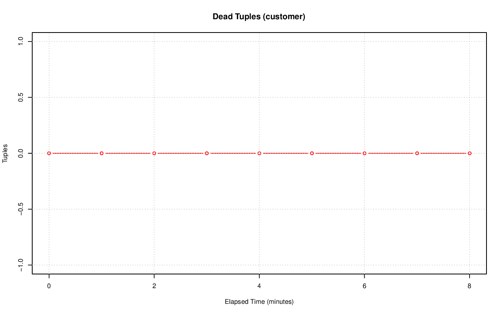
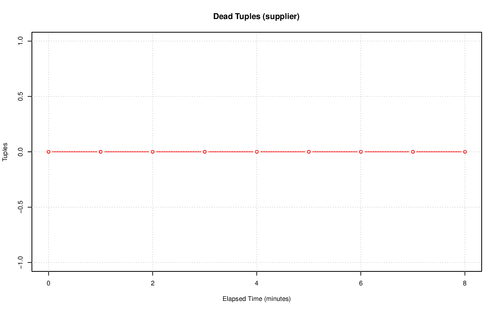

================================================================================
Database Test 3 Table n_dead_tup Charts
================================================================================

.. image:: ../table-stat-lineitem-n_dead_tup.png
   :target: ../table-stat-lineitem-n_dead_tup.png
   :width: 100%

.. image:: ../table-stat-nation-n_dead_tup.png
   :target: ../table-stat-nation-n_dead_tup.png
   :width: 100%

.. image:: ../table-stat-orders-n_dead_tup.png
   :target: ../table-stat-orders-n_dead_tup.png
   :width: 100%

.. image:: ../table-stat-part-n_dead_tup.png
   :target: ../table-stat-part-n_dead_tup.png
   :width: 100%

.. image:: ../table-stat-partsupp-n_dead_tup.png
   :target: ../table-stat-partsupp-n_dead_tup.png
   :width: 100%

.. image:: ../table-stat-region-n_dead_tup.png
   :target: ../table-stat-region-n_dead_tup.png
   :width: 100%

.. image:: ../table-stat-time_statistics-n_dead_tup.png
   :target: ../table-stat-time_statistics-n_dead_tup.png
   :width: 100%
