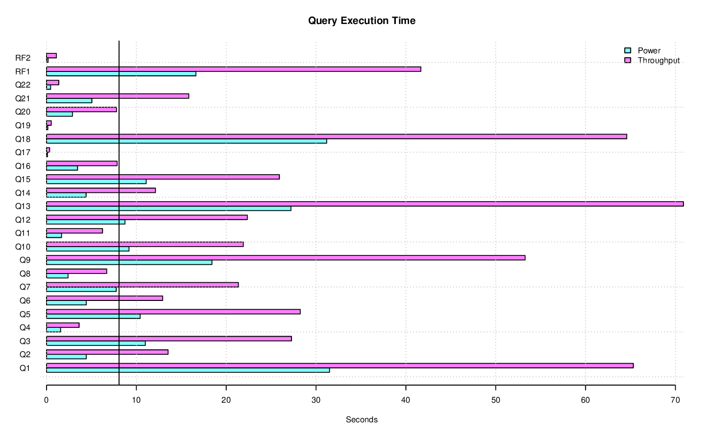

======================
Database Test 3 Report
======================

**These results are not comparable to TPC Benchmark(TM) H Results.**

Summary
=======

* Date:  Wed Jun  1 23:34:24 UTC 2022
* Database Size: 10 GB
* Database Manager: PostgreSQL 14.3
* Operating System: 5.15.41-gentoo-x86_64-zbkstdxg5
* Notes: 

Metrics
=======

======================  ============  ==========================================
       Composite Score      6583.532
Load Test Time (hours)           .13  `CPU <load/cpu/>`__ `Memory <load/mem/>`__ `Blockdev <load/blockdev/>`__ `Network <load/net/>`__ `Swap <load/swap/>`__
      Power Test Score      9130.818  `CPU <power/cpu/>`__ `Memory <power/mem/>`__ `Blockdev <power/blockdev/>`__ `Network <power/net/>`__ `Swap <power/swap/>`__
 Throughput Test Score       4746.88  `CPU <throughput/cpu/>`__ `Memory <throughput/mem/>`__ `Blockdev <throughput/blockdev/>`__ `Network <throughput/net/>`__ `Swap <throughput/swap/>`__
======================  ============  ==========================================

Query Times
===========

Power Test
----------

* Seed: 601232222

+------------------+----------------------+----------------------+----------------------+
|Duration (seconds)|Query Start Time      |RF1 Start Time        |RF2 Start Time        |
|                  +----------------------+----------------------+----------------------+
|                  |Query End Time        |RF1 End Time          |RF2 End Time          |
+==================+======================+======================+======================+
|            216.21|2022-06-01 23:22:43.55|2022-06-01 23:22:26.91|2022-06-01 23:26:02.94|
|                  +----------------------+----------------------+----------------------+
|                  |2022-06-01 23:26:02.72|2022-06-01 23:22:43.54|2022-06-01 23:26:03.10|
+------------------+----------------------+----------------------+----------------------+

=====  =======================  ==
Query  Response Time (seconds)
=====  =======================  ==
    1                    31.50  `Plan <power/plans/1.txt>`__ | `Result <power/results/1.txt>`__
    2                     4.42  `Plan <power/plans/2.txt>`__ | `Result <power/results/2.txt>`__
    3                    10.99  `Plan <power/plans/3.txt>`__ | `Result <power/results/3.txt>`__
    4                     1.57  `Plan <power/plans/4.txt>`__ | `Result <power/results/4.txt>`__
    5                    10.42  `Plan <power/plans/5.txt>`__ | `Result <power/results/5.txt>`__
    6                     4.43  `Plan <power/plans/6.txt>`__ | `Result <power/results/6.txt>`__
    7                     7.76  `Plan <power/plans/7.txt>`__ | `Result <power/results/7.txt>`__
    8                     2.39  `Plan <power/plans/8.txt>`__ | `Result <power/results/8.txt>`__
    9                    18.41  `Plan <power/plans/9.txt>`__ | `Result <power/results/9.txt>`__
   10                     9.18  `Plan <power/plans/10.txt>`__ | `Result <power/results/10.txt>`__
   11                     1.67  `Plan <power/plans/11.txt>`__ | `Result <power/results/11.txt>`__
   12                     8.73  `Plan <power/plans/12.txt>`__ | `Result <power/results/12.txt>`__
   13                    27.21  `Plan <power/plans/13.txt>`__ | `Result <power/results/13.txt>`__
   14                     4.40  `Plan <power/plans/14.txt>`__ | `Result <power/results/14.txt>`__
   15                    11.09  `Plan <power/plans/15.txt>`__ | `Result <power/results/15.txt>`__
   16                     3.45  `Plan <power/plans/16.txt>`__ | `Result <power/results/16.txt>`__
   17                     0.11  `Plan <power/plans/17.txt>`__ | `Result <power/results/17.txt>`__
   18                    31.19  `Plan <power/plans/18.txt>`__ | `Result <power/results/18.txt>`__
   19                     0.14  `Plan <power/plans/19.txt>`__ | `Result <power/results/19.txt>`__
   20                     2.89  `Plan <power/plans/20.txt>`__ | `Result <power/results/20.txt>`__
   21                     5.04  `Plan <power/plans/21.txt>`__ | `Result <power/results/21.txt>`__
   22                     0.46  `Plan <power/plans/22.txt>`__ | `Result <power/results/22.txt>`__
  RF1                    16.63  `Result <power/results/rf1.txt>`__
  RF2                     0.16  `Result <power/results/rf2.txt>`__
=====  =======================  ==

Throughput Test
---------------

Stream execution summary:

+---------+---------+----------------------+----------------------+----------------------+
|Stream   |Duration |Query Start Time      |RF1 Start Time        |RF2 Start Time        |
+---------+(seconds)+----------------------+----------------------+----------------------+
|Seed     |         |Query End Time        |RF1 End Time          |RF2 End Time          |
+=========+=========+======================+======================+======================+
|        1|   499.24|2022-06-01 23:26:21.62|2022-06-01 23:26:04.48|2022-06-01 23:26:45.84|
+---------+         +----------------------+----------------------+----------------------+
|601232223|         |2022-06-01 23:26:50.20|2022-06-01 23:26:45.75|2022-06-01 23:26:46.80|
+---------+---------+----------------------+----------------------+----------------------+
|        2|   490.30|2022-06-01 23:26:04.75|2022-06-01 23:26:46.86|2022-06-01 23:27:30.45|
+---------+         +----------------------+----------------------+----------------------+
|601232224|         |2022-06-01 23:26:16.41|2022-06-01 23:27:30.37|2022-06-01 23:27:31.55|
+---------+---------+----------------------+----------------------+----------------------+
|        3|   491.61|2022-06-01 23:26:04.75|2022-06-01 23:27:31.71|2022-06-01 23:28:12.06|
+---------+         +----------------------+----------------------+----------------------+
|601232225|         |2022-06-01 23:26:11.05|2022-06-01 23:28:11.97|2022-06-01 23:28:13.29|
+---------+---------+----------------------+----------------------+----------------------+

Query execution duration (seconds) (Click **P** for plans and **R** for results):

======  ===============================================================================  ===============================================================================  ===============================================================================  ===============================================================================  ===============================================================================  ===============================================================================  ===============================================================================
Stream  Q1                                                                               Q2                                                                               Q3                                                                               Q4                                                                               Q5                                                                               Q6                                                                               Q7                                                                             
======  ===============================================================================  ===============================================================================  ===============================================================================  ===============================================================================  ===============================================================================  ===============================================================================  ===============================================================================
     1    62.60   `P <throughput/plans/1/1.txt>`__   `R <throughput/results/1/1.txt>`__    11.57   `P <throughput/plans/1/2.txt>`__   `R <throughput/results/1/2.txt>`__    28.58   `P <throughput/plans/1/3.txt>`__   `R <throughput/results/1/3.txt>`__     1.34   `P <throughput/plans/1/4.txt>`__   `R <throughput/results/1/4.txt>`__    30.22   `P <throughput/plans/1/5.txt>`__   `R <throughput/results/1/5.txt>`__    13.08   `P <throughput/plans/1/6.txt>`__   `R <throughput/results/1/6.txt>`__    25.72   `P <throughput/plans/1/7.txt>`__   `R <throughput/results/1/7.txt>`__
     2    59.63   `P <throughput/plans/2/1.txt>`__   `R <throughput/results/2/1.txt>`__    16.76   `P <throughput/plans/2/2.txt>`__   `R <throughput/results/2/2.txt>`__    29.10   `P <throughput/plans/2/3.txt>`__   `R <throughput/results/2/3.txt>`__     4.19   `P <throughput/plans/2/4.txt>`__   `R <throughput/results/2/4.txt>`__    27.22   `P <throughput/plans/2/5.txt>`__   `R <throughput/results/2/5.txt>`__    11.66   `P <throughput/plans/2/6.txt>`__   `R <throughput/results/2/6.txt>`__    18.31   `P <throughput/plans/2/7.txt>`__   `R <throughput/results/2/7.txt>`__
     3    73.72   `P <throughput/plans/3/1.txt>`__   `R <throughput/results/3/1.txt>`__    12.25   `P <throughput/plans/3/2.txt>`__   `R <throughput/results/3/2.txt>`__    24.12   `P <throughput/plans/3/3.txt>`__   `R <throughput/results/3/3.txt>`__     5.36   `P <throughput/plans/3/4.txt>`__   `R <throughput/results/3/4.txt>`__    27.28   `P <throughput/plans/3/5.txt>`__   `R <throughput/results/3/5.txt>`__    14.05   `P <throughput/plans/3/6.txt>`__   `R <throughput/results/3/6.txt>`__    20.05   `P <throughput/plans/3/7.txt>`__   `R <throughput/results/3/7.txt>`__
   Min                                                                            59.63                                                                            11.57                                                                            24.12                                                                             1.34                                                                            27.22                                                                            11.66                                                                            18.31
   Max                                                                            73.72                                                                            16.76                                                                            29.10                                                                             5.36                                                                            30.22                                                                            14.05                                                                            25.72
   Avg                                                                            65.32                                                                            13.53                                                                            27.27                                                                             3.63                                                                            28.24                                                                            12.93                                                                            21.36
======  ===============================================================================  ===============================================================================  ===============================================================================  ===============================================================================  ===============================================================================  ===============================================================================  ===============================================================================

======  ===============================================================================  ===============================================================================  ===============================================================================  ===============================================================================  ===============================================================================  ===============================================================================  ===============================================================================
Stream  Q8                                                                               Q9                                                                               Q10                                                                              Q11                                                                              Q12                                                                              Q13                                                                              Q14                                                                            
======  ===============================================================================  ===============================================================================  ===============================================================================  ===============================================================================  ===============================================================================  ===============================================================================  ===============================================================================
     1     6.35   `P <throughput/plans/1/8.txt>`__   `R <throughput/results/1/8.txt>`__    48.58   `P <throughput/plans/1/9.txt>`__   `R <throughput/results/1/9.txt>`__    21.26  `P <throughput/plans/1/10.txt>`__  `R <throughput/results/1/10.txt>`__     7.96  `P <throughput/plans/1/11.txt>`__  `R <throughput/results/1/11.txt>`__    22.24  `P <throughput/plans/1/12.txt>`__  `R <throughput/results/1/12.txt>`__    65.33  `P <throughput/plans/1/13.txt>`__  `R <throughput/results/1/13.txt>`__    12.20  `P <throughput/plans/1/14.txt>`__  `R <throughput/results/1/14.txt>`__
     2     7.47   `P <throughput/plans/2/8.txt>`__   `R <throughput/results/2/8.txt>`__    69.91   `P <throughput/plans/2/9.txt>`__   `R <throughput/results/2/9.txt>`__    25.65  `P <throughput/plans/2/10.txt>`__  `R <throughput/results/2/10.txt>`__     6.36  `P <throughput/plans/2/11.txt>`__  `R <throughput/results/2/11.txt>`__    19.38  `P <throughput/plans/2/12.txt>`__  `R <throughput/results/2/12.txt>`__    68.19  `P <throughput/plans/2/13.txt>`__  `R <throughput/results/2/13.txt>`__    11.94  `P <throughput/plans/2/14.txt>`__  `R <throughput/results/2/14.txt>`__
     3     6.30   `P <throughput/plans/3/8.txt>`__   `R <throughput/results/3/8.txt>`__    41.32   `P <throughput/plans/3/9.txt>`__   `R <throughput/results/3/9.txt>`__    18.81  `P <throughput/plans/3/10.txt>`__  `R <throughput/results/3/10.txt>`__     4.37  `P <throughput/plans/3/11.txt>`__  `R <throughput/results/3/11.txt>`__    25.43  `P <throughput/plans/3/12.txt>`__  `R <throughput/results/3/12.txt>`__    79.16  `P <throughput/plans/3/13.txt>`__  `R <throughput/results/3/13.txt>`__    12.23  `P <throughput/plans/3/14.txt>`__  `R <throughput/results/3/14.txt>`__
   Min                                                                             6.30                                                                            41.32                                                                            18.81                                                                             4.37                                                                            19.38                                                                            65.33                                                                            11.94
   Max                                                                             7.47                                                                            69.91                                                                            25.65                                                                             7.96                                                                            25.43                                                                            79.16                                                                            12.23
   Avg                                                                             6.70                                                                            53.27                                                                            21.91                                                                             6.23                                                                            22.35                                                                            70.89                                                                            12.12
======  ===============================================================================  ===============================================================================  ===============================================================================  ===============================================================================  ===============================================================================  ===============================================================================  ===============================================================================

======  ===============================================================================  ===============================================================================  ===============================================================================  ===============================================================================  ===============================================================================  ===============================================================================  ===============================================================================
Stream  Q15                                                                              Q16                                                                              Q17                                                                              Q18                                                                              Q19                                                                              Q20                                                                              Q21                                                                            
======  ===============================================================================  ===============================================================================  ===============================================================================  ===============================================================================  ===============================================================================  ===============================================================================  ===============================================================================
     1    27.69  `P <throughput/plans/1/15.txt>`__  `R <throughput/results/1/15.txt>`__     6.71  `P <throughput/plans/1/16.txt>`__  `R <throughput/results/1/16.txt>`__     0.26  `P <throughput/plans/1/17.txt>`__  `R <throughput/results/1/17.txt>`__    77.03  `P <throughput/plans/1/18.txt>`__  `R <throughput/results/1/18.txt>`__     0.59  `P <throughput/plans/1/19.txt>`__  `R <throughput/results/1/19.txt>`__     7.32  `P <throughput/plans/1/20.txt>`__  `R <throughput/results/1/20.txt>`__    16.76  `P <throughput/plans/1/21.txt>`__  `R <throughput/results/1/21.txt>`__
     2    22.54  `P <throughput/plans/2/15.txt>`__  `R <throughput/results/2/15.txt>`__    10.51  `P <throughput/plans/2/16.txt>`__  `R <throughput/results/2/16.txt>`__     0.35  `P <throughput/plans/2/17.txt>`__  `R <throughput/results/2/17.txt>`__    53.94  `P <throughput/plans/2/18.txt>`__  `R <throughput/results/2/18.txt>`__     0.64  `P <throughput/plans/2/19.txt>`__  `R <throughput/results/2/19.txt>`__     7.61  `P <throughput/plans/2/20.txt>`__  `R <throughput/results/2/20.txt>`__    15.94  `P <throughput/plans/2/21.txt>`__  `R <throughput/results/2/21.txt>`__
     3    27.53  `P <throughput/plans/3/15.txt>`__  `R <throughput/results/3/15.txt>`__     6.35  `P <throughput/plans/3/16.txt>`__  `R <throughput/results/3/16.txt>`__     0.42  `P <throughput/plans/3/17.txt>`__  `R <throughput/results/3/17.txt>`__    62.81  `P <throughput/plans/3/18.txt>`__  `R <throughput/results/3/18.txt>`__     0.36  `P <throughput/plans/3/19.txt>`__  `R <throughput/results/3/19.txt>`__     8.44  `P <throughput/plans/3/20.txt>`__  `R <throughput/results/3/20.txt>`__    14.80  `P <throughput/plans/3/21.txt>`__  `R <throughput/results/3/21.txt>`__
   Min                                                                            22.54                                                                             6.35                                                                             0.26                                                                            53.94                                                                             0.36                                                                             7.32                                                                            14.80
   Max                                                                            27.69                                                                            10.51                                                                             0.42                                                                            77.03                                                                             0.64                                                                             8.44                                                                            16.76
   Avg                                                                            25.92                                                                             7.86                                                                             0.34                                                                            64.59                                                                             0.53                                                                             7.79                                                                            15.83
======  ===============================================================================  ===============================================================================  ===============================================================================  ===============================================================================  ===============================================================================  ===============================================================================  ===============================================================================

======  ===============================================================================  ===============================================================================  ===============================================================================
Stream  Q22                                                                              RF1                                                                              RF2                                                                            
======  ===============================================================================  ===============================================================================  ===============================================================================
     1     1.07  `P <throughput/plans/1/22.txt>`__  `R <throughput/results/1/22.txt>`__    41.27                                    `R <throughput/results/1/rf1.txt>`__     0.96                                    `R <throughput/results/1/rf2.txt>`__
     2     1.28  `P <throughput/plans/2/22.txt>`__  `R <throughput/results/2/22.txt>`__    43.50                                    `R <throughput/results/2/rf1.txt>`__     1.09                                    `R <throughput/results/2/rf2.txt>`__
     3     1.74  `P <throughput/plans/3/22.txt>`__  `R <throughput/results/3/22.txt>`__    40.26                                    `R <throughput/results/3/rf1.txt>`__     1.23                                    `R <throughput/results/3/rf2.txt>`__
   Min                                                                             1.07                                                                            40.26                                                                             0.96
   Max                                                                             1.74                                                                            43.50                                                                             1.23
   Avg                                                                             1.36                                                                            41.68                                                                             1.09
======  ===============================================================================  ===============================================================================  ===============================================================================

PostgreSQL Report
=================

Load Test
--------------------------------------------------------------------------------

* `Database Settings <load/param.txt>`__
* Per Process Statistics:  `autovacum <load/autovacum/>`__ `bgwriter <load/bgwriter/>`__ `checkpointer <load/checkpointer/>`__ `logger <load/logger/>`__ `logical <load/logical/>`__ `statscollector <load/statscollector/>`__ `walwriter <load/walwriter/>`__

.. list-table::

   * - `Database Stats Charts <load/stats/>`__
     -
   * - Database Table Stats Charts:
     - `customer <load/tables/customer/>`__ `lineitem <load/tables/lineitem/>`__ `nation <load/tables/nation/>`__ `orders <load/tables/orders/>`__ `part <load/tables/part/>`__ `partsupp <load/tables/partsupp/>`__ `region <load/tables/region/>`__ `supplier <load/tables/supplier/>`__ `time_statistics <load/tables/time_statistics/>`__ 
   * - Database Index Stats Charts:
     - 
   * - Database Tables by Metric:
     - `heap_blks_hit <load/tables/t_heap_blks_hit/>`__ `heap_blks_read <load/tables/t_heap_blks_read/>`__ `idx_blks_hit <load/tables/t_idx_blks_hit/>`__ `idx_blks_read <load/tables/t_idx_blks_read/>`__ `idx_scan <load/tables/t_idx_scan/>`__ `idx_tup_fetch <load/tables/t_idx_tup_fetch/>`__ `n_dead_tup <load/tables/t_n_dead_tup/>`__ `n_live_tup <load/tables/t_n_live_tup/>`__ `n_tup_del <load/tables/t_n_tup_del/>`__ `n_tup_hot_upd <load/tables/t_n_tup_hot_upd/>`__ `n_tup_ins <load/tables/t_n_tup_ins/>`__ `n_tup_upd <load/tables/t_n_tup_upd/>`__ `seq_scan <load/tables/t_seq_scan/>`__ `seq_tup_read <load/tables/t_seq_tup_read/>`__ `tidx_blks_read <load/tables/t_tidx_blks_read/>`__ `toast_blks_hit <load/tables/t_toast_blks_hit/>`__ `toast_blks_read <load/tables/t_toast_blks_read/>`__ 
   * - Database Indexs by Metric:
     - 

Power Test
--------------------------------------------------------------------------------

* `Database Settings <power/param.txt>`__
* Per Process Statistics:  `autovacum <power/autovacum/>`__ `bgwriter <power/bgwriter/>`__ `checkpointer <power/checkpointer/>`__ `logger <power/logger/>`__ `logical <power/logical/>`__ `statscollector <power/statscollector/>`__ `walwriter <power/walwriter/>`__

.. list-table::

   * - `Database Stats Charts <power/stats/>`__
     -
   * - Database Table Stats Charts:
     - `customer <power/tables/customer/>`__ `lineitem <power/tables/lineitem/>`__ `nation <power/tables/nation/>`__ `orders <power/tables/orders/>`__ `part <power/tables/part/>`__ `partsupp <power/tables/partsupp/>`__ `region <power/tables/region/>`__ `supplier <power/tables/supplier/>`__ `time_statistics <power/tables/time_statistics/>`__ 
   * - Database Index Stats Charts:
     - `customer_c_mktsegment_c_custkey_idx <power/indexes/customer_c_mktsegment_c_custkey_idx/>`__ `customer_c_nationkey_c_custkey_idx <power/indexes/customer_c_nationkey_c_custkey_idx/>`__ `customer_c_phone_c_acctbal_c_custkey_idx <power/indexes/customer_c_phone_c_acctbal_c_custkey_idx/>`__ `customer_c_phone_idx_c_acctbal <power/indexes/customer_c_phone_idx_c_acctbal/>`__ `lineitem_l_orderkey_idx_l_returnflag <power/indexes/lineitem_l_orderkey_idx_l_returnflag/>`__ `lineitem_l_orderkey_idx_part2 <power/indexes/lineitem_l_orderkey_idx_part2/>`__ `lineitem_l_orderkey_l_suppkey_idx <power/indexes/lineitem_l_orderkey_l_suppkey_idx/>`__ `lineitem_l_orderkey_l_suppkey_l_quantity_idx <power/indexes/lineitem_l_orderkey_l_suppkey_l_quantity_idx/>`__ `lineitem_l_partkey_l_quantity_l_shipmode_idx <power/indexes/lineitem_l_partkey_l_quantity_l_shipmode_idx/>`__ `lineitem_l_partkey_l_suppkey_l_shipdate_l_quantity_idx <power/indexes/lineitem_l_partkey_l_suppkey_l_shipdate_l_quantity_idx/>`__ `lineitem_l_receiptdate_idx <power/indexes/lineitem_l_receiptdate_idx/>`__ `lineitem_l_shipdate_idx <power/indexes/lineitem_l_shipdate_idx/>`__ `orders_o_custkey_idx <power/indexes/orders_o_custkey_idx/>`__ `orders_o_orderdate_idx <power/indexes/orders_o_orderdate_idx/>`__ `orders_o_orderkey_o_orderdate_idx <power/indexes/orders_o_orderkey_o_orderdate_idx/>`__ `part_ios_test1 <power/indexes/part_ios_test1/>`__ `part_p_container_p_brand_p_partkey_idx <power/indexes/part_p_container_p_brand_p_partkey_idx/>`__ `part_p_size_idx <power/indexes/part_p_size_idx/>`__ `part_p_type_p_partkey_idx <power/indexes/part_p_type_p_partkey_idx/>`__ `partsupp_ps_suppkey_idx <power/indexes/partsupp_ps_suppkey_idx/>`__ `pk_customer <power/indexes/pk_customer/>`__ `pk_lineitem <power/indexes/pk_lineitem/>`__ `pk_nation <power/indexes/pk_nation/>`__ `pk_orders <power/indexes/pk_orders/>`__ `pk_part <power/indexes/pk_part/>`__ `pk_partsupp <power/indexes/pk_partsupp/>`__ `pk_region <power/indexes/pk_region/>`__ `pk_supplier <power/indexes/pk_supplier/>`__ `supplier_s_nationkey_s_suppkey_idx <power/indexes/supplier_s_nationkey_s_suppkey_idx/>`__ `supplier_s_suppkey_idx_like <power/indexes/supplier_s_suppkey_idx_like/>`__ 
   * - Database Tables by Metric:
     - `heap_blks_hit <power/tables/t_heap_blks_hit/>`__ `heap_blks_read <power/tables/t_heap_blks_read/>`__ `idx_blks_hit <power/tables/t_idx_blks_hit/>`__ `idx_blks_read <power/tables/t_idx_blks_read/>`__ `idx_scan <power/tables/t_idx_scan/>`__ `idx_tup_fetch <power/tables/t_idx_tup_fetch/>`__ `n_dead_tup <power/tables/t_n_dead_tup/>`__ `n_live_tup <power/tables/t_n_live_tup/>`__ `n_tup_del <power/tables/t_n_tup_del/>`__ `n_tup_hot_upd <power/tables/t_n_tup_hot_upd/>`__ `n_tup_ins <power/tables/t_n_tup_ins/>`__ `n_tup_upd <power/tables/t_n_tup_upd/>`__ `seq_scan <power/tables/t_seq_scan/>`__ `seq_tup_read <power/tables/t_seq_tup_read/>`__ `tidx_blks_read <power/tables/t_tidx_blks_read/>`__ `toast_blks_hit <power/tables/t_toast_blks_hit/>`__ `toast_blks_read <power/tables/t_toast_blks_read/>`__ 
   * - Database Indexs by Metric:
     - `idx_blks <power/indexes/i_idx_blks/>`__ `idx_blks_hit <power/indexes/i_idx_blks_hit/>`__ `idx_blks_read <power/indexes/i_idx_blks_read/>`__ `idx_scan <power/indexes/i_idx_scan/>`__ `idx_tup_fetch <power/indexes/i_idx_tup_fetch/>`__ `idx_tup_read <power/indexes/i_idx_tup_read/>`__ 

Throughput Test
--------------------------------------------------------------------------------

* `Database Settings <throughput/param.txt>`__
* Per Process Statistics:  `autovacum <throughput/autovacum/>`__ `bgwriter <throughput/bgwriter/>`__ `checkpointer <throughput/checkpointer/>`__ `logger <throughput/logger/>`__ `logical <throughput/logical/>`__ `statscollector <throughput/statscollector/>`__ `walwriter <throughput/walwriter/>`__

.. list-table::

   * - `Database Stats Charts <throughput/stats/>`__
     -
   * - Database Table Stats Charts:
     - `customer <throughput/tables/customer/>`__ `lineitem <throughput/tables/lineitem/>`__ `nation <throughput/tables/nation/>`__ `orders <throughput/tables/orders/>`__ `part <throughput/tables/part/>`__ `partsupp <throughput/tables/partsupp/>`__ `region <throughput/tables/region/>`__ `supplier <throughput/tables/supplier/>`__ `time_statistics <throughput/tables/time_statistics/>`__ 
   * - Database Index Stats Charts:
     - `customer_c_mktsegment_c_custkey_idx <throughput/indexes/customer_c_mktsegment_c_custkey_idx/>`__ `customer_c_nationkey_c_custkey_idx <throughput/indexes/customer_c_nationkey_c_custkey_idx/>`__ `customer_c_phone_c_acctbal_c_custkey_idx <throughput/indexes/customer_c_phone_c_acctbal_c_custkey_idx/>`__ `customer_c_phone_idx_c_acctbal <throughput/indexes/customer_c_phone_idx_c_acctbal/>`__ `lineitem_l_orderkey_idx_l_returnflag <throughput/indexes/lineitem_l_orderkey_idx_l_returnflag/>`__ `lineitem_l_orderkey_idx_part2 <throughput/indexes/lineitem_l_orderkey_idx_part2/>`__ `lineitem_l_orderkey_l_suppkey_idx <throughput/indexes/lineitem_l_orderkey_l_suppkey_idx/>`__ `lineitem_l_orderkey_l_suppkey_l_quantity_idx <throughput/indexes/lineitem_l_orderkey_l_suppkey_l_quantity_idx/>`__ `lineitem_l_partkey_l_quantity_l_shipmode_idx <throughput/indexes/lineitem_l_partkey_l_quantity_l_shipmode_idx/>`__ `lineitem_l_partkey_l_suppkey_l_shipdate_l_quantity_idx <throughput/indexes/lineitem_l_partkey_l_suppkey_l_shipdate_l_quantity_idx/>`__ `lineitem_l_receiptdate_idx <throughput/indexes/lineitem_l_receiptdate_idx/>`__ `lineitem_l_shipdate_idx <throughput/indexes/lineitem_l_shipdate_idx/>`__ `orders_o_custkey_idx <throughput/indexes/orders_o_custkey_idx/>`__ `orders_o_orderdate_idx <throughput/indexes/orders_o_orderdate_idx/>`__ `orders_o_orderkey_o_orderdate_idx <throughput/indexes/orders_o_orderkey_o_orderdate_idx/>`__ `part_ios_test1 <throughput/indexes/part_ios_test1/>`__ `part_p_container_p_brand_p_partkey_idx <throughput/indexes/part_p_container_p_brand_p_partkey_idx/>`__ `part_p_size_idx <throughput/indexes/part_p_size_idx/>`__ `part_p_type_p_partkey_idx <throughput/indexes/part_p_type_p_partkey_idx/>`__ `partsupp_ps_suppkey_idx <throughput/indexes/partsupp_ps_suppkey_idx/>`__ `pk_customer <throughput/indexes/pk_customer/>`__ `pk_lineitem <throughput/indexes/pk_lineitem/>`__ `pk_nation <throughput/indexes/pk_nation/>`__ `pk_orders <throughput/indexes/pk_orders/>`__ `pk_part <throughput/indexes/pk_part/>`__ `pk_partsupp <throughput/indexes/pk_partsupp/>`__ `pk_region <throughput/indexes/pk_region/>`__ `pk_supplier <throughput/indexes/pk_supplier/>`__ `supplier_s_nationkey_s_suppkey_idx <throughput/indexes/supplier_s_nationkey_s_suppkey_idx/>`__ `supplier_s_suppkey_idx_like <throughput/indexes/supplier_s_suppkey_idx_like/>`__ 
   * - Database Tables by Metric:
     - `heap_blks_hit <throughput/tables/t_heap_blks_hit/>`__ `heap_blks_read <throughput/tables/t_heap_blks_read/>`__ `idx_blks_hit <throughput/tables/t_idx_blks_hit/>`__ `idx_blks_read <throughput/tables/t_idx_blks_read/>`__ `idx_scan <throughput/tables/t_idx_scan/>`__ `idx_tup_fetch <throughput/tables/t_idx_tup_fetch/>`__ `n_dead_tup <throughput/tables/t_n_dead_tup/>`__ `n_live_tup <throughput/tables/t_n_live_tup/>`__ `n_tup_del <throughput/tables/t_n_tup_del/>`__ `n_tup_hot_upd <throughput/tables/t_n_tup_hot_upd/>`__ `n_tup_ins <throughput/tables/t_n_tup_ins/>`__ `n_tup_upd <throughput/tables/t_n_tup_upd/>`__ `seq_scan <throughput/tables/t_seq_scan/>`__ `seq_tup_read <throughput/tables/t_seq_tup_read/>`__ `tidx_blks_read <throughput/tables/t_tidx_blks_read/>`__ `toast_blks_hit <throughput/tables/t_toast_blks_hit/>`__ `toast_blks_read <throughput/tables/t_toast_blks_read/>`__ 
   * - Database Indexs by Metric:
     - `idx_blks <throughput/indexes/i_idx_blks/>`__ `idx_blks_hit <throughput/indexes/i_idx_blks_hit/>`__ `idx_blks_read <throughput/indexes/i_idx_blks_read/>`__ `idx_scan <throughput/indexes/i_idx_scan/>`__ `idx_tup_fetch <throughput/indexes/i_idx_tup_fetch/>`__ `idx_tup_read <throughput/indexes/i_idx_tup_read/>`__ 
