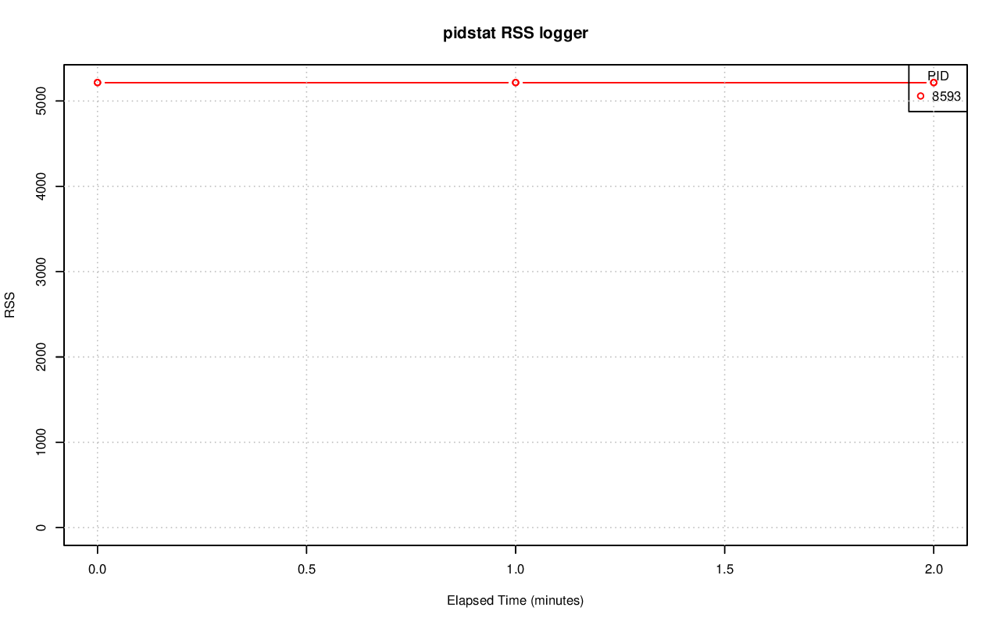
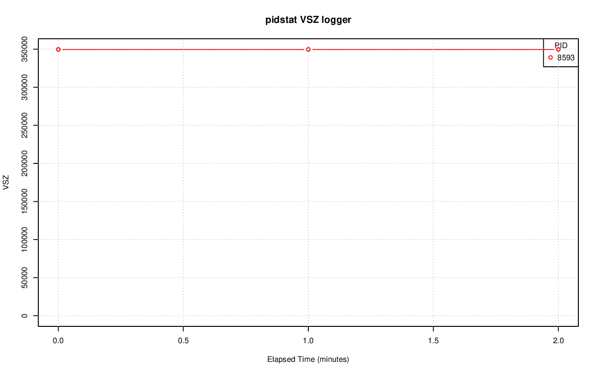
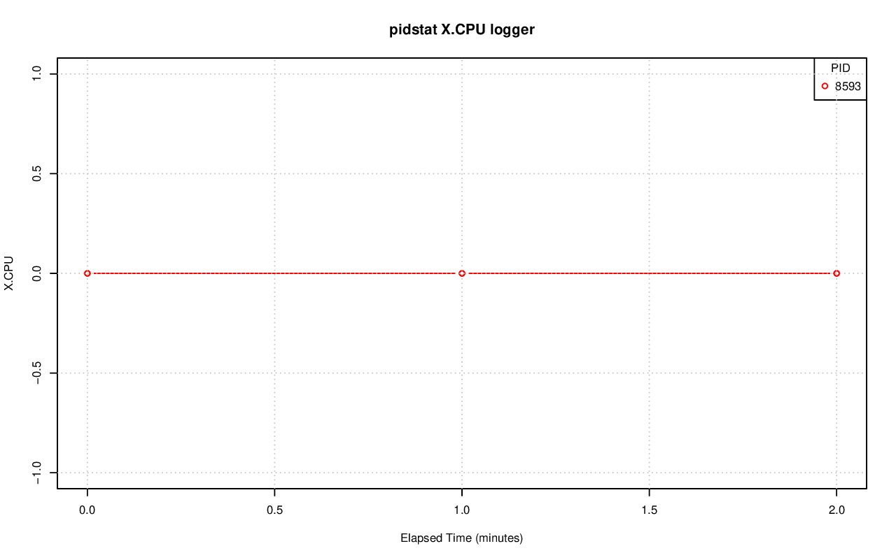
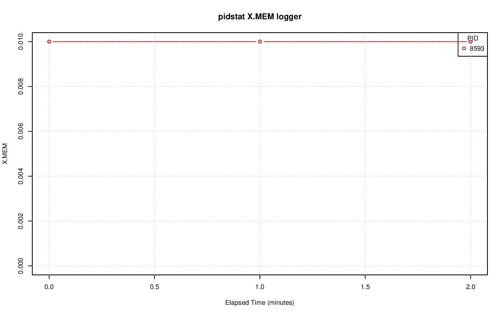
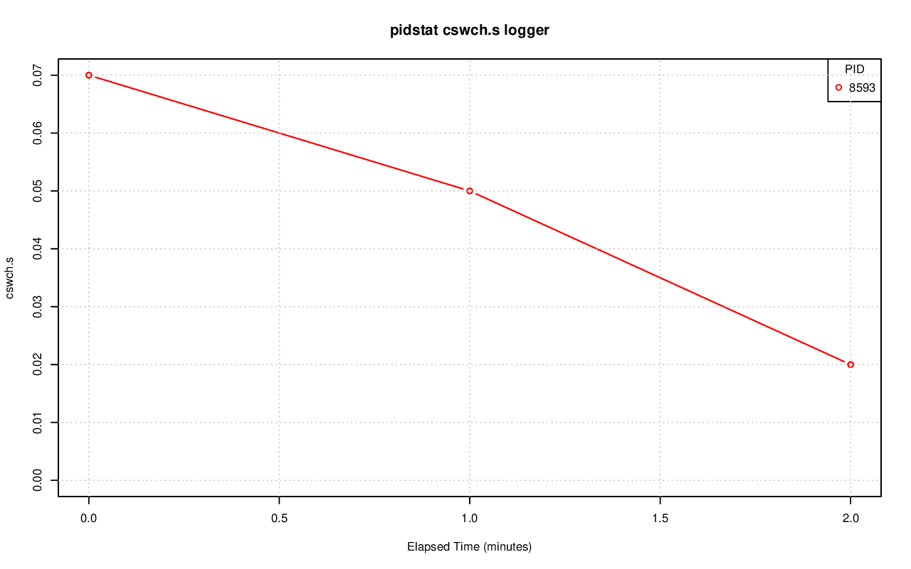
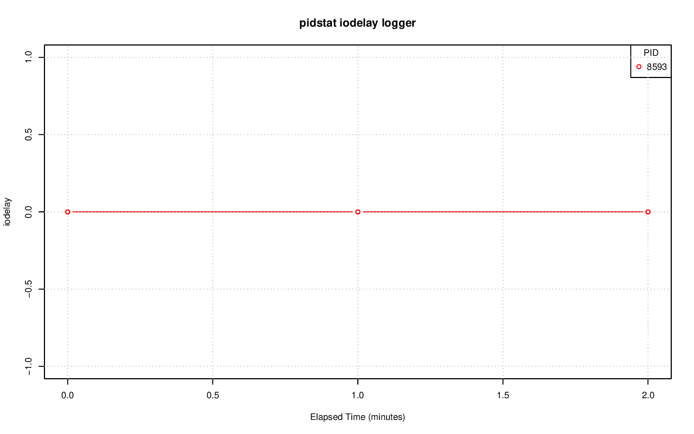
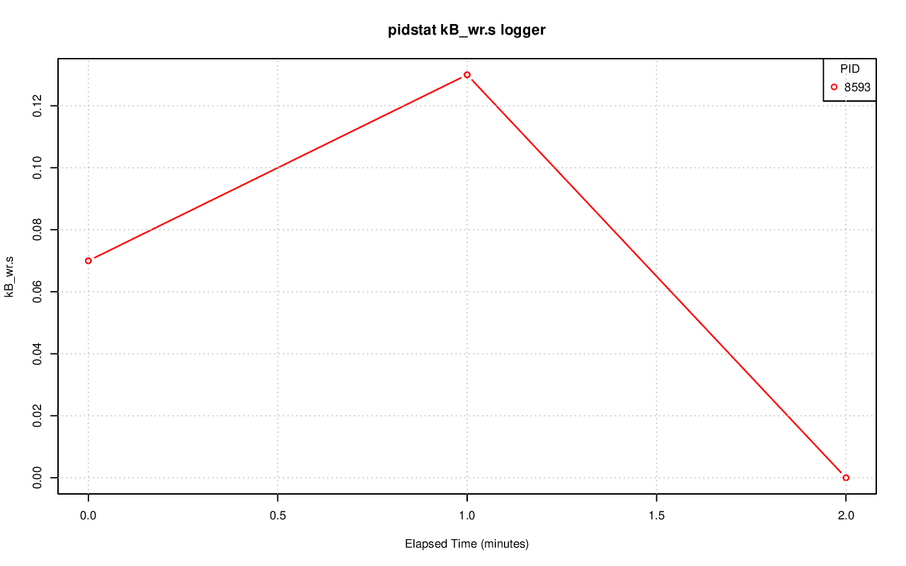

================================================================================
Database Test 3 pidstat logger Charts
================================================================================

