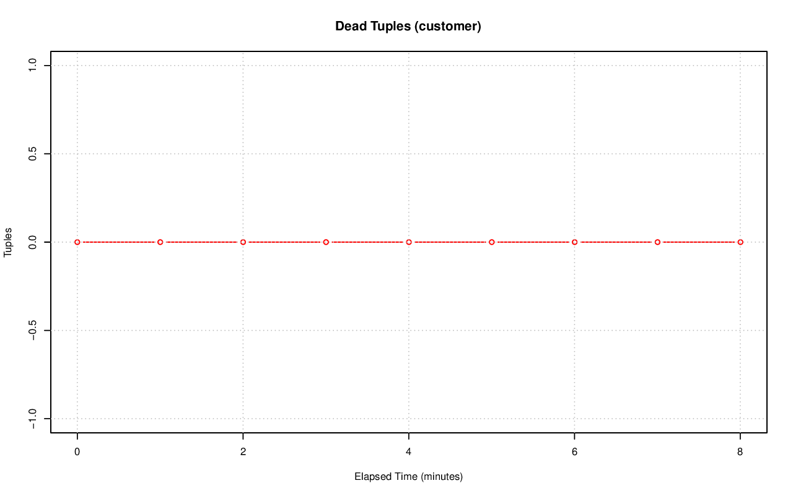
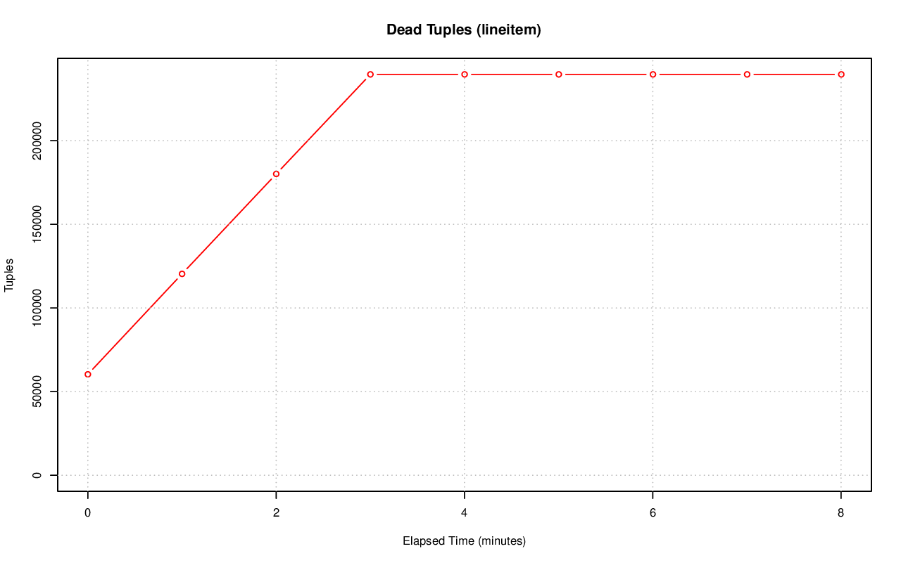
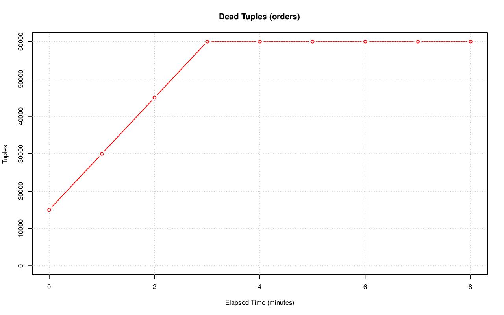
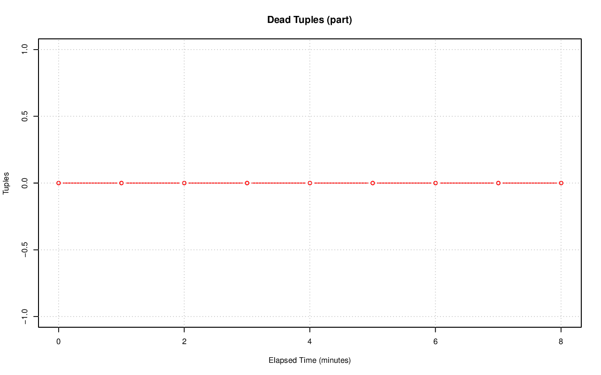
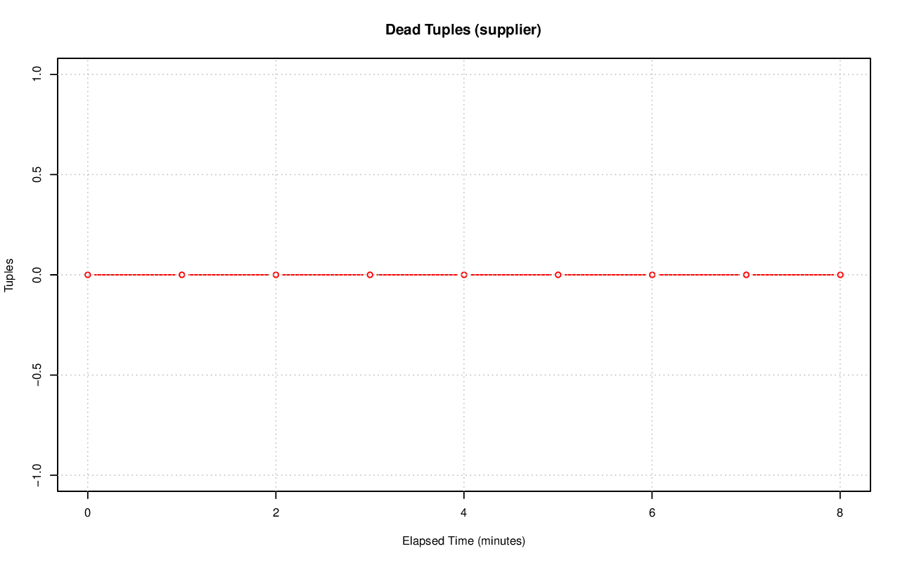

================================================================================
Database Test 3 Table n_dead_tup Charts
================================================================================

.. image:: ../table-stat-partsupp-n_dead_tup.png
   :target: ../table-stat-partsupp-n_dead_tup.png
   :width: 100%

.. image:: ../table-stat-time_statistics-n_dead_tup.png
   :target: ../table-stat-time_statistics-n_dead_tup.png
   :width: 100%
