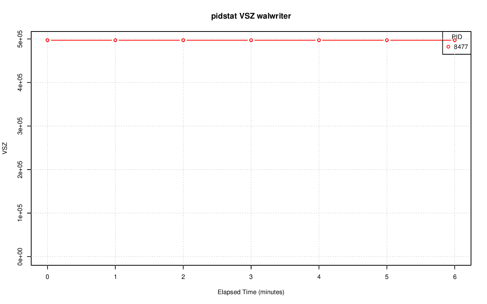
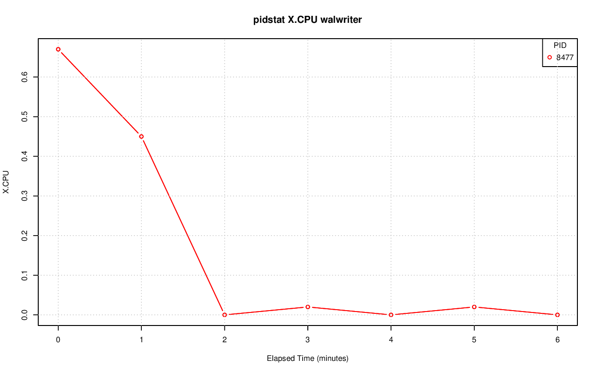
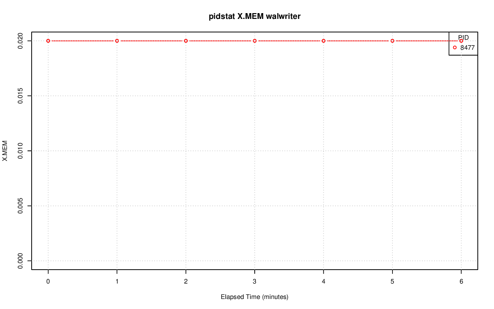
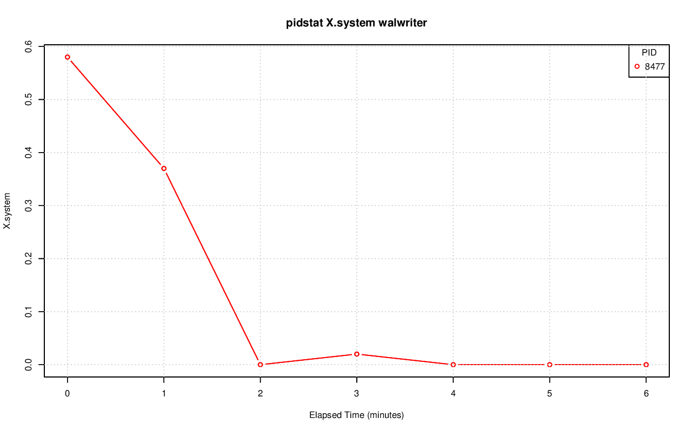
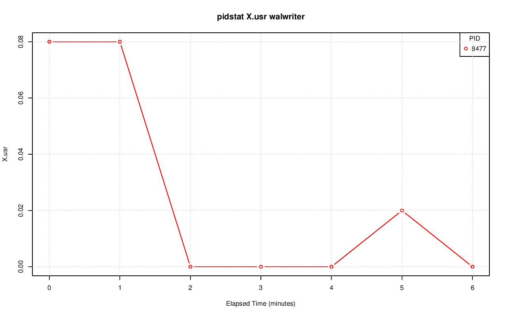
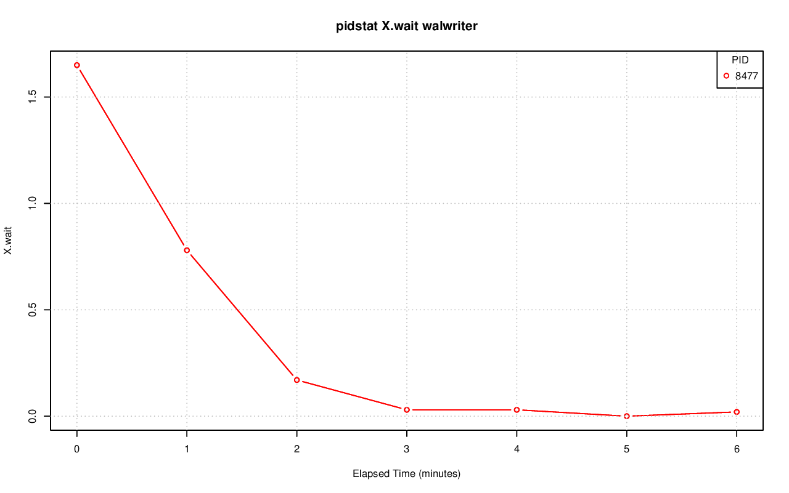
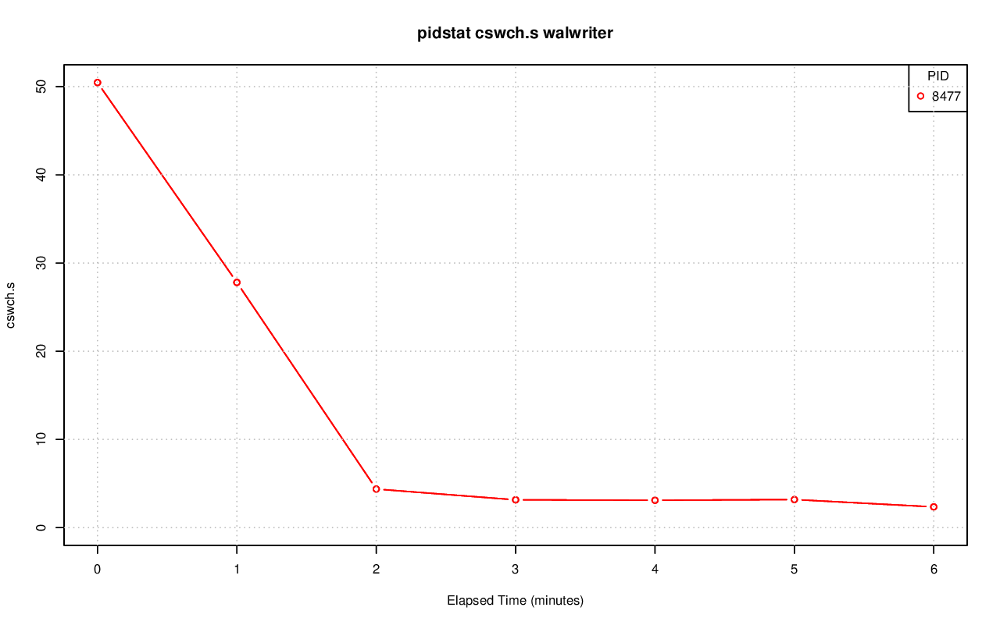
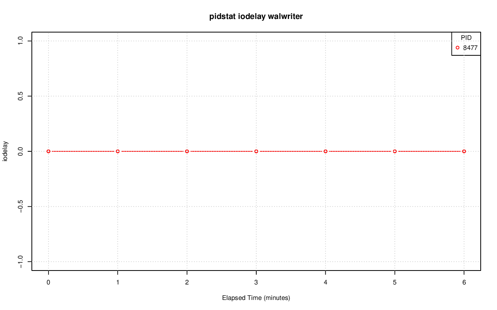
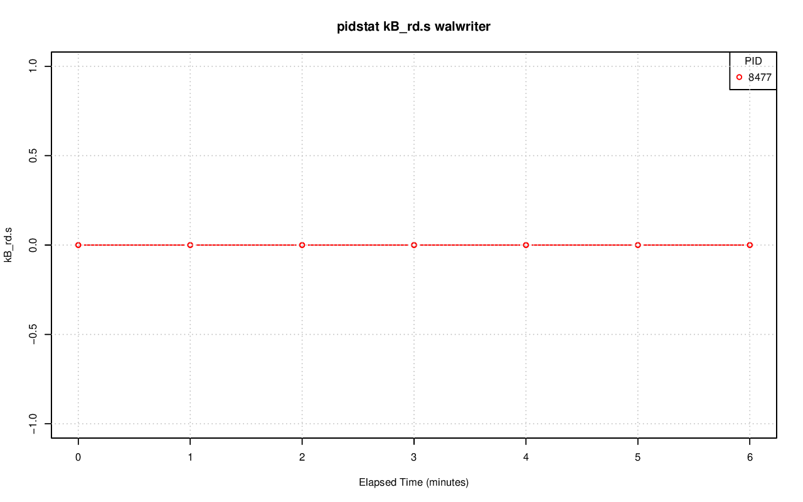
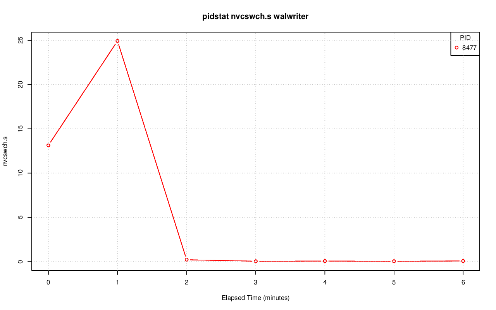

================================================================================
Database Test 3 pidstat walwriter Charts
================================================================================

.. image:: pidstat-walwriter-kB_wr.s.png
   :target: pidstat-walwriter-kB_wr.s.png
   :width: 100%

