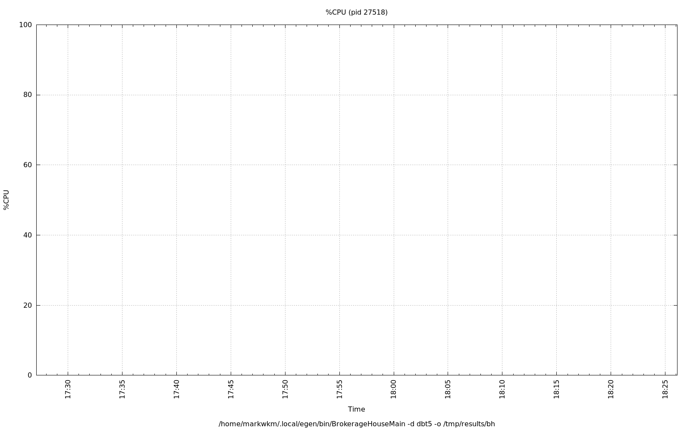
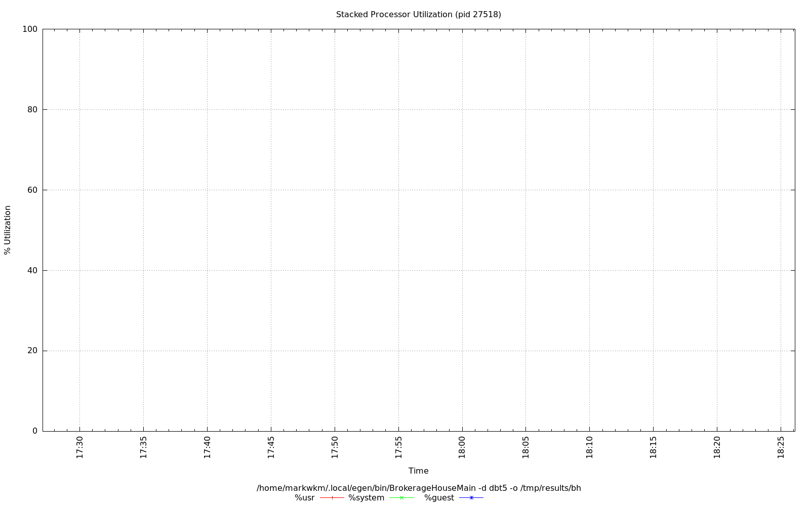
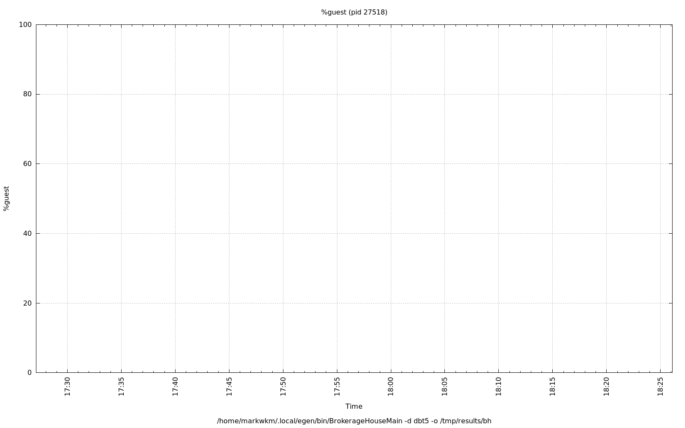
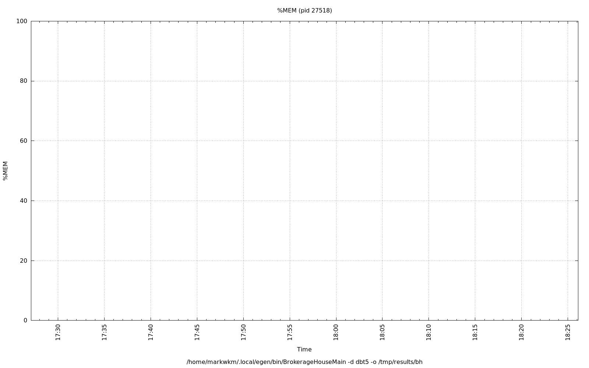

================================================================================
Database Test 5 pidstat BrokerageHouseMain Charts
================================================================================

.. image:: ../sysstat/pidstat/pidstat-27518-cswch_s.png
   :target: ../sysstat/pidstat/pidstat-27518-cswch_s.png
   :width: 100%

.. image:: ../sysstat/pidstat/pidstat-27518-io.png
   :target: ../sysstat/pidstat/pidstat-27518-io.png
   :width: 100%

.. image:: ../sysstat/pidstat/pidstat-27518-kB_ccwr_s.png
   :target: ../sysstat/pidstat/pidstat-27518-kB_ccwr_s.png
   :width: 100%

.. image:: ../sysstat/pidstat/pidstat-27518-kB_rd_s.png
   :target: ../sysstat/pidstat/pidstat-27518-kB_rd_s.png
   :width: 100%

.. image:: ../sysstat/pidstat/pidstat-27518-kB_wr_s.png
   :target: ../sysstat/pidstat/pidstat-27518-kB_wr_s.png
   :width: 100%

.. image:: ../sysstat/pidstat/pidstat-27518-majflt_s.png
   :target: ../sysstat/pidstat/pidstat-27518-majflt_s.png
   :width: 100%

.. image:: ../sysstat/pidstat/pidstat-27518-minflt_s.png
   :target: ../sysstat/pidstat/pidstat-27518-minflt_s.png
   :width: 100%

.. image:: ../sysstat/pidstat/pidstat-27518-nvcswch_s.png
   :target: ../sysstat/pidstat/pidstat-27518-nvcswch_s.png
   :width: 100%

.. image:: ../sysstat/pidstat/pidstat-27518-RSS.png
   :target: ../sysstat/pidstat/pidstat-27518-RSS.png
   :width: 100%

.. image:: ../sysstat/pidstat/pidstat-27518-VSZ.png
   :target: ../sysstat/pidstat/pidstat-27518-VSZ.png
   :width: 100%
