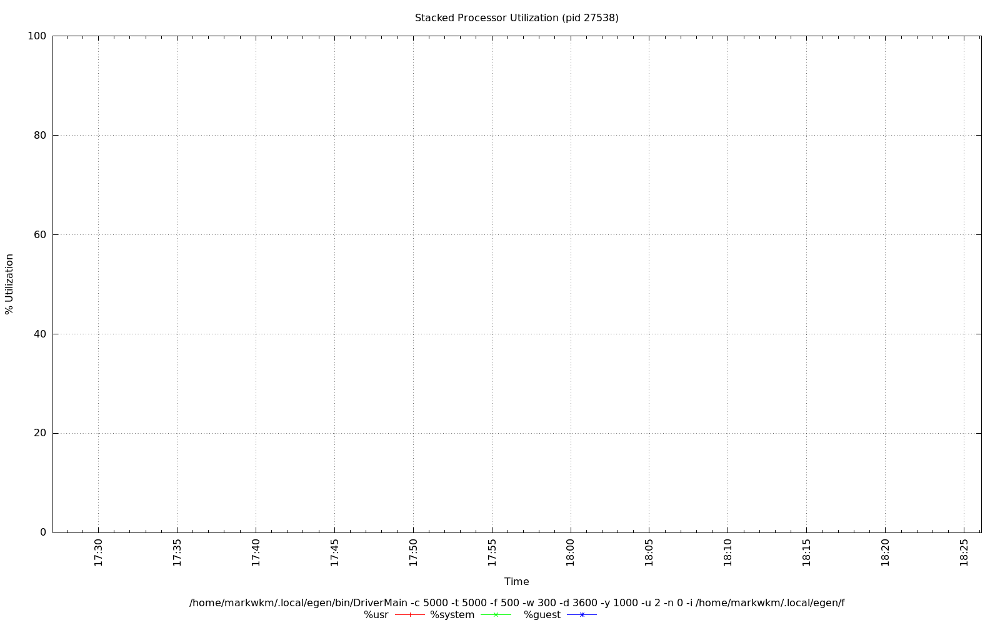
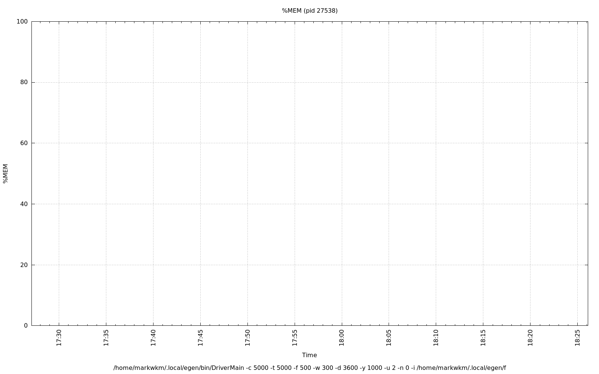
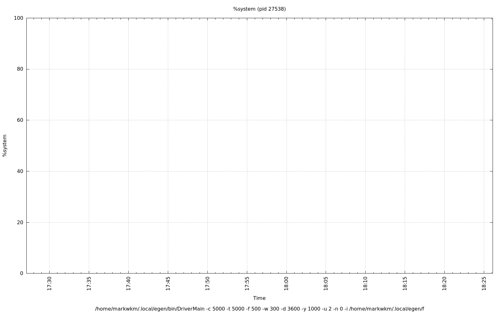
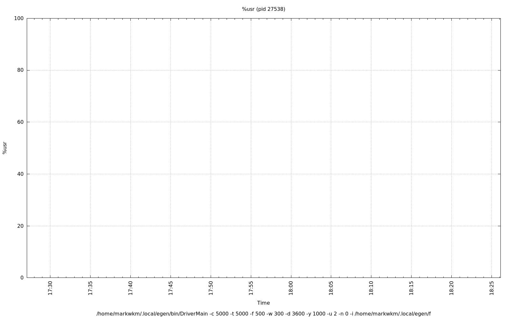

================================================================================
Database Test 5 pidstat DriverMain Charts
================================================================================

.. image:: ../sysstat/pidstat/pidstat-27538-cswch_s.png
   :target: ../sysstat/pidstat/pidstat-27538-cswch_s.png
   :width: 100%

.. image:: ../sysstat/pidstat/pidstat-27538-io.png
   :target: ../sysstat/pidstat/pidstat-27538-io.png
   :width: 100%

.. image:: ../sysstat/pidstat/pidstat-27538-kB_ccwr_s.png
   :target: ../sysstat/pidstat/pidstat-27538-kB_ccwr_s.png
   :width: 100%

.. image:: ../sysstat/pidstat/pidstat-27538-kB_rd_s.png
   :target: ../sysstat/pidstat/pidstat-27538-kB_rd_s.png
   :width: 100%

.. image:: ../sysstat/pidstat/pidstat-27538-kB_wr_s.png
   :target: ../sysstat/pidstat/pidstat-27538-kB_wr_s.png
   :width: 100%

.. image:: ../sysstat/pidstat/pidstat-27538-majflt_s.png
   :target: ../sysstat/pidstat/pidstat-27538-majflt_s.png
   :width: 100%

.. image:: ../sysstat/pidstat/pidstat-27538-minflt_s.png
   :target: ../sysstat/pidstat/pidstat-27538-minflt_s.png
   :width: 100%

.. image:: ../sysstat/pidstat/pidstat-27538-nvcswch_s.png
   :target: ../sysstat/pidstat/pidstat-27538-nvcswch_s.png
   :width: 100%

.. image:: ../sysstat/pidstat/pidstat-27538-RSS.png
   :target: ../sysstat/pidstat/pidstat-27538-RSS.png
   :width: 100%

.. image:: ../sysstat/pidstat/pidstat-27538-VSZ.png
   :target: ../sysstat/pidstat/pidstat-27538-VSZ.png
   :width: 100%
