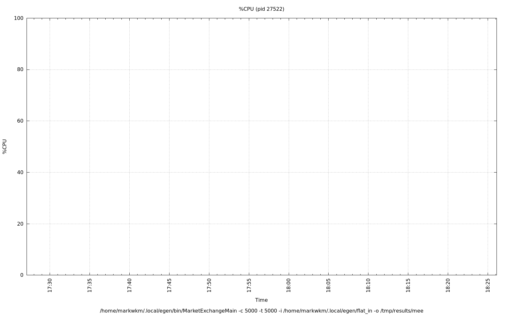
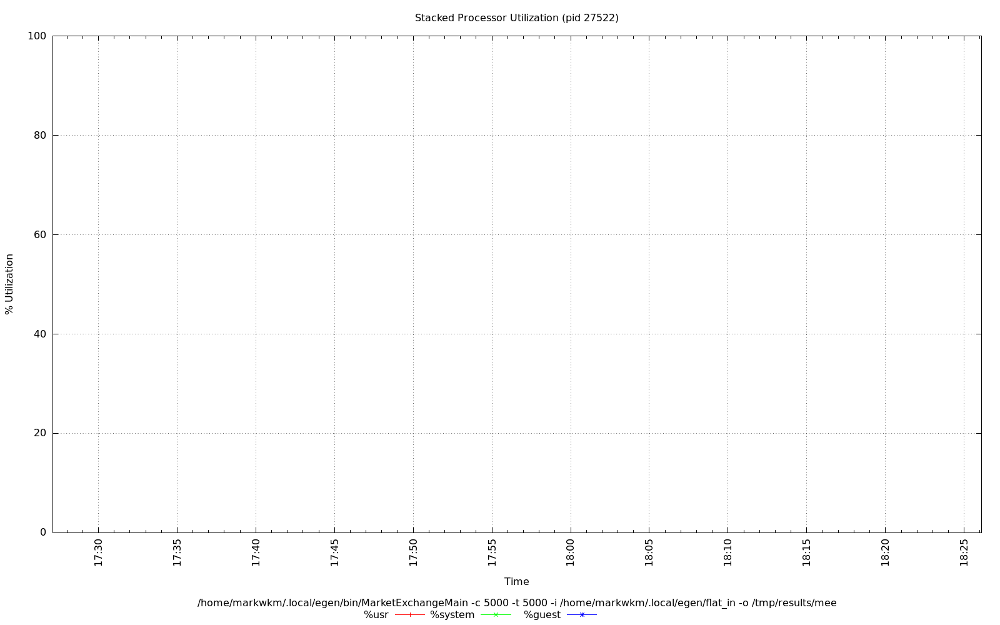
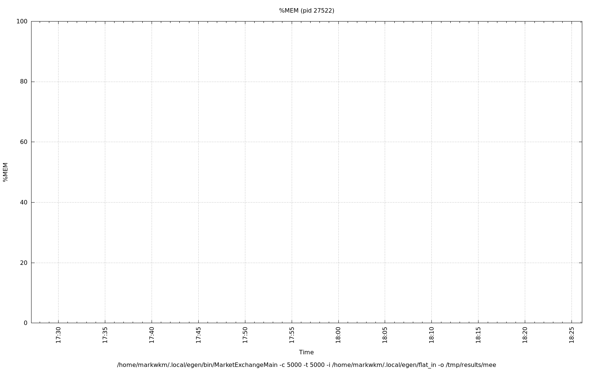
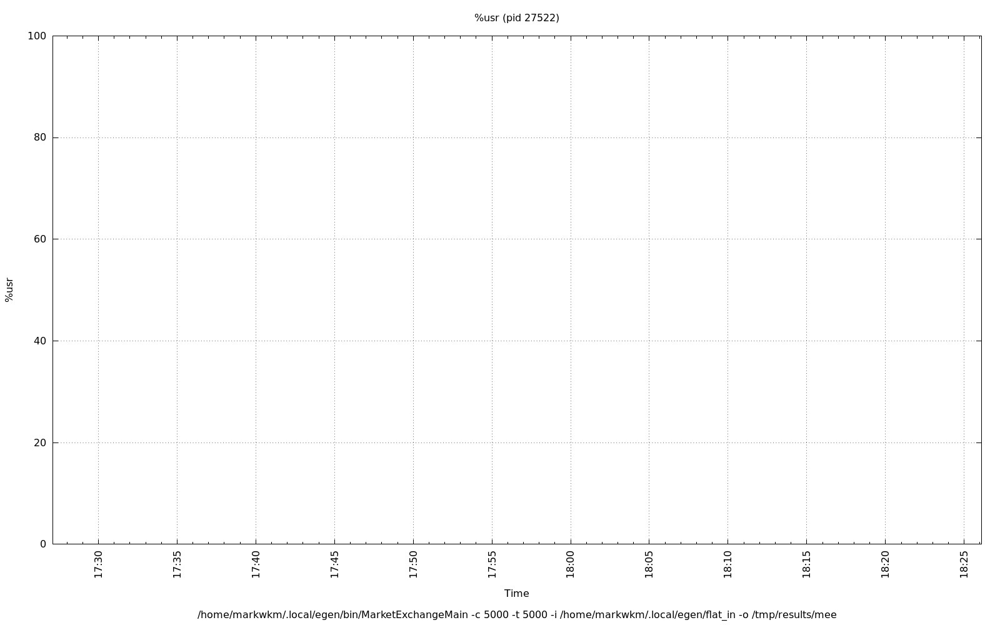

================================================================================
Database Test 5 pidstat MarketExchangeMain Charts
================================================================================

.. image:: ../sysstat/pidstat/pidstat-27522-cswch_s.png
   :target: ../sysstat/pidstat/pidstat-27522-cswch_s.png
   :width: 100%

.. image:: ../sysstat/pidstat/pidstat-27522-io.png
   :target: ../sysstat/pidstat/pidstat-27522-io.png
   :width: 100%

.. image:: ../sysstat/pidstat/pidstat-27522-kB_ccwr_s.png
   :target: ../sysstat/pidstat/pidstat-27522-kB_ccwr_s.png
   :width: 100%

.. image:: ../sysstat/pidstat/pidstat-27522-kB_rd_s.png
   :target: ../sysstat/pidstat/pidstat-27522-kB_rd_s.png
   :width: 100%

.. image:: ../sysstat/pidstat/pidstat-27522-kB_wr_s.png
   :target: ../sysstat/pidstat/pidstat-27522-kB_wr_s.png
   :width: 100%

.. image:: ../sysstat/pidstat/pidstat-27522-majflt_s.png
   :target: ../sysstat/pidstat/pidstat-27522-majflt_s.png
   :width: 100%

.. image:: ../sysstat/pidstat/pidstat-27522-minflt_s.png
   :target: ../sysstat/pidstat/pidstat-27522-minflt_s.png
   :width: 100%

.. image:: ../sysstat/pidstat/pidstat-27522-nvcswch_s.png
   :target: ../sysstat/pidstat/pidstat-27522-nvcswch_s.png
   :width: 100%

.. image:: ../sysstat/pidstat/pidstat-27522-RSS.png
   :target: ../sysstat/pidstat/pidstat-27522-RSS.png
   :width: 100%

.. image:: ../sysstat/pidstat/pidstat-27522-VSZ.png
   :target: ../sysstat/pidstat/pidstat-27522-VSZ.png
   :width: 100%
