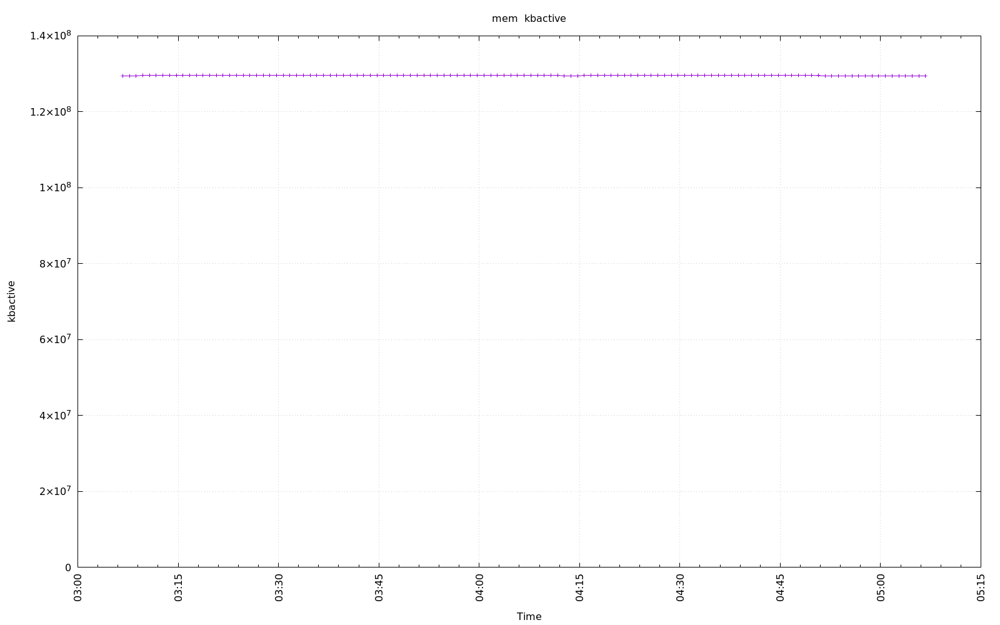
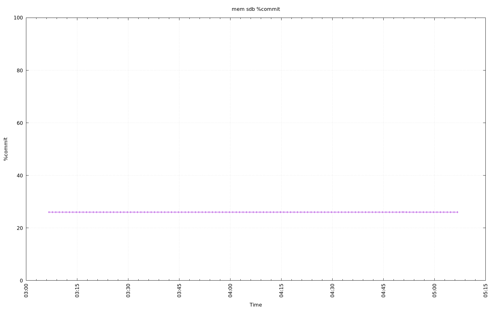
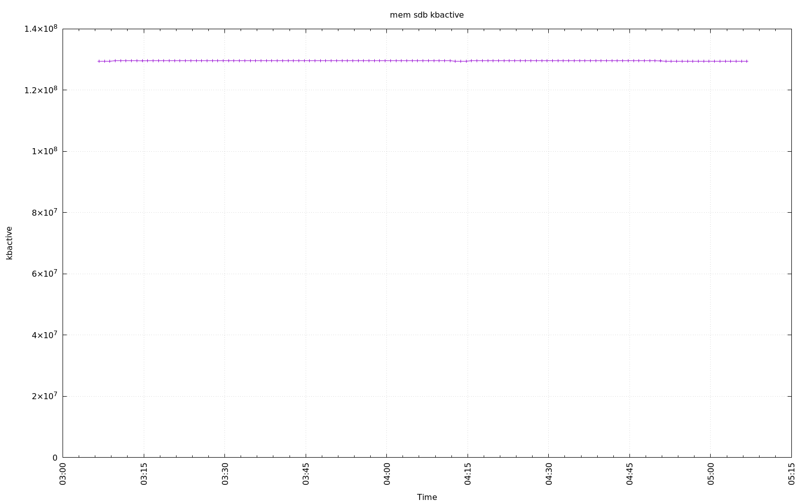

================================================================================
Database Test 7 power mem Charts
================================================================================

.. image:: ../sysstat/sar/mem/sar-mem-sdb-kbmemfree.png
   :target: ../sysstat/sar/mem/sar-mem-sdb-kbmemfree.png
   :width: 100%

