================================================================================
Database Test 7 pidstat autovacuum Charts
================================================================================

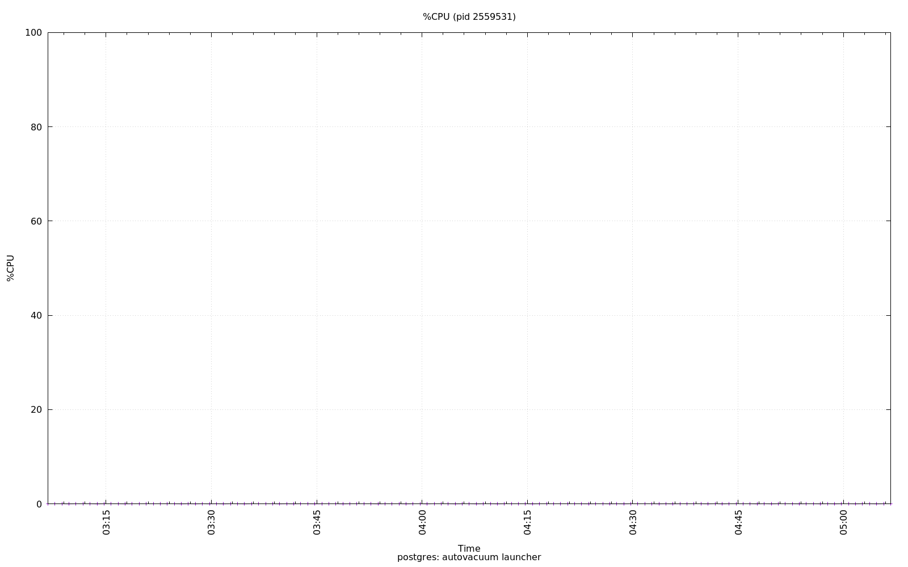

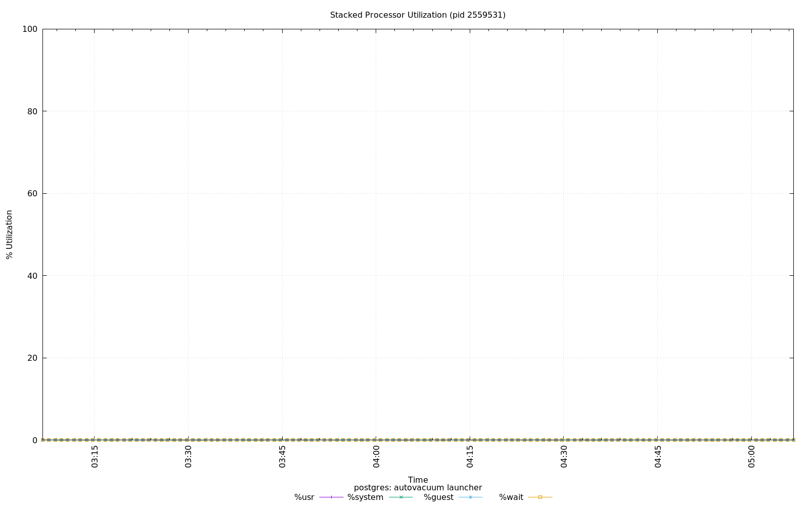

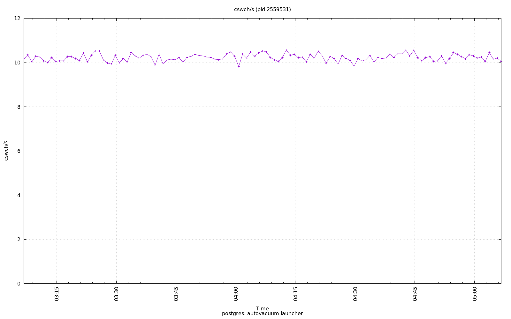

.. image:: ../pidstat/pidstat-2559531-fd-nr.png
   :target: ../pidstat/pidstat-2559531-fd-nr.png
   :width: 100%

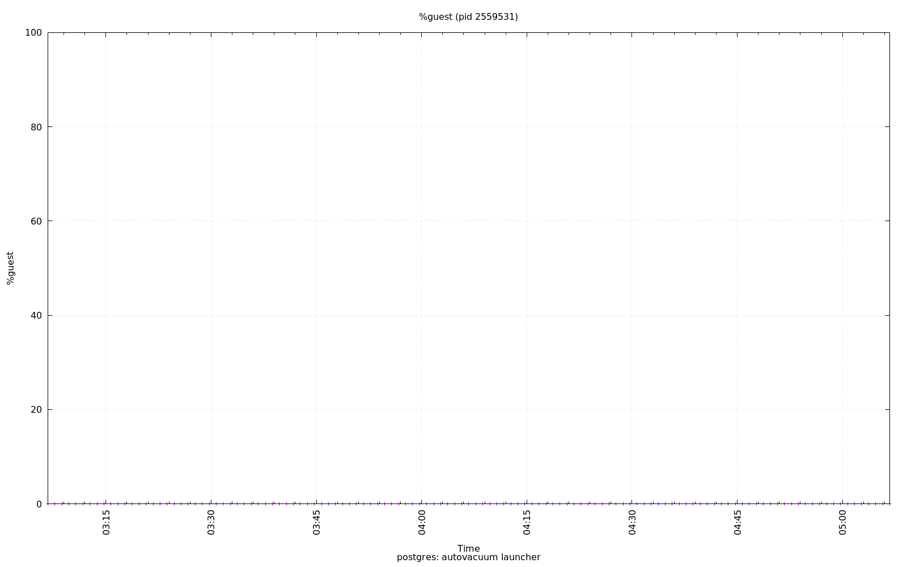

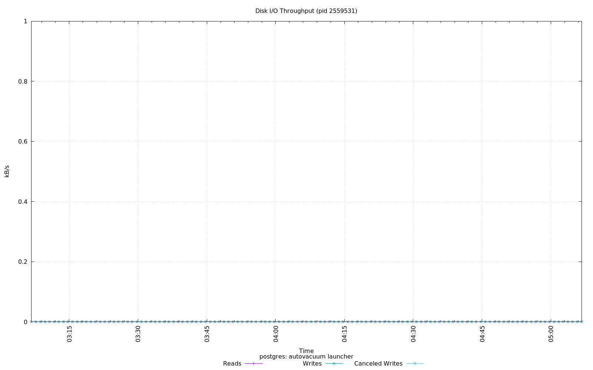

.. image:: ../pidstat/pidstat-2559531-MEM.png
   :target: ../pidstat/pidstat-2559531-MEM.png
   :width: 100%

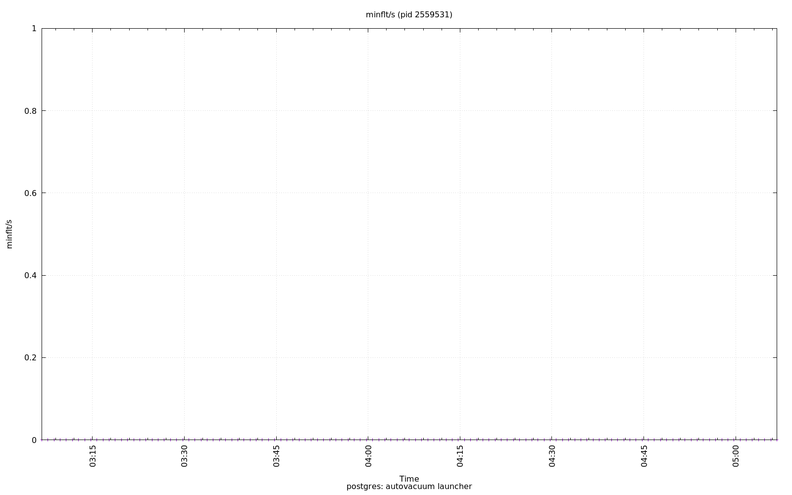

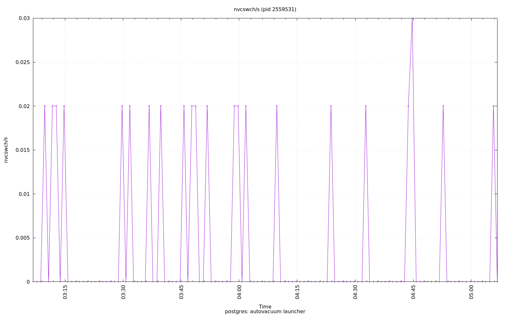

.. image:: ../pidstat/pidstat-2559531-RSS.png
   :target: ../pidstat/pidstat-2559531-RSS.png
   :width: 100%

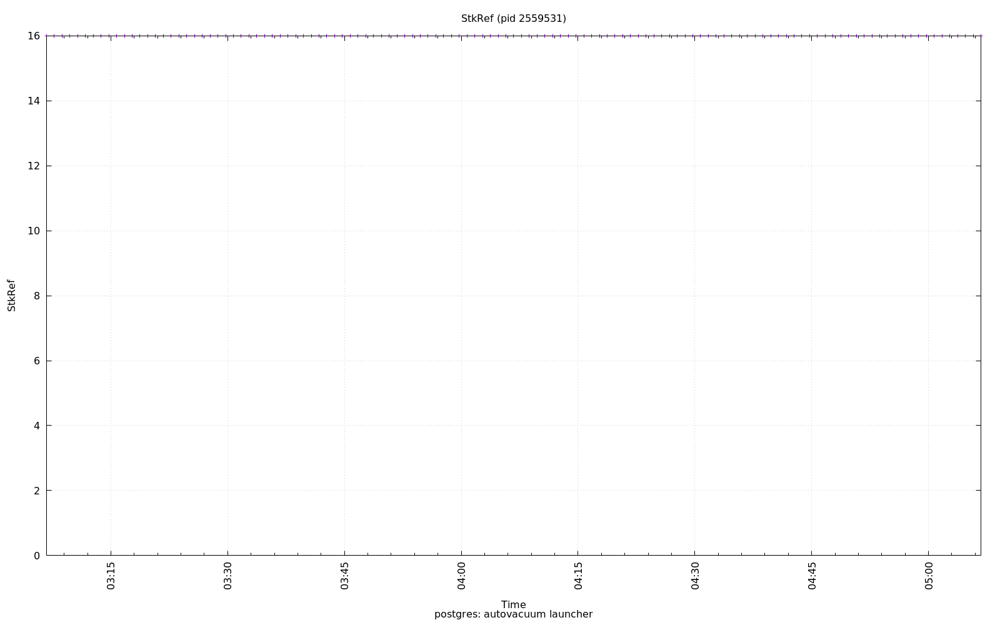

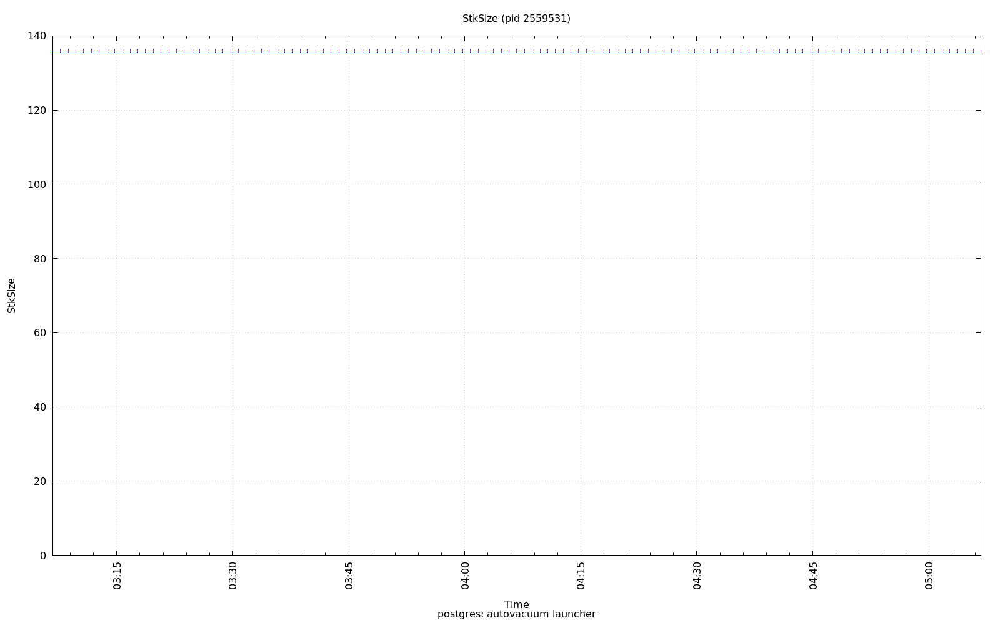

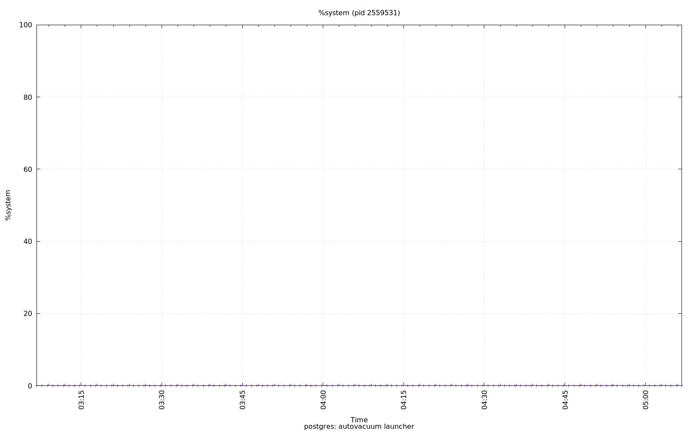

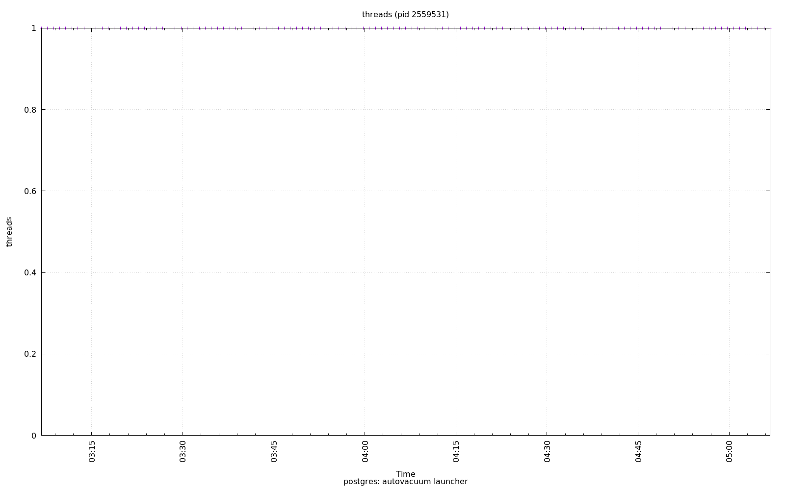

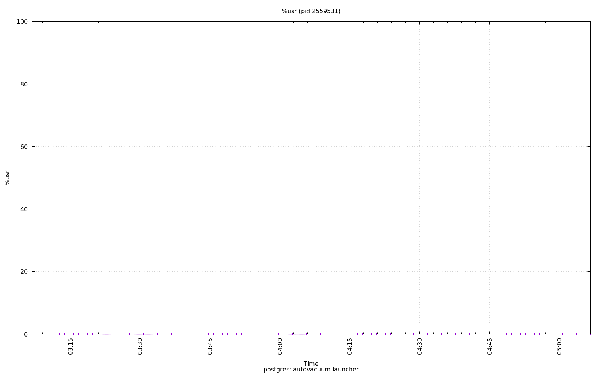

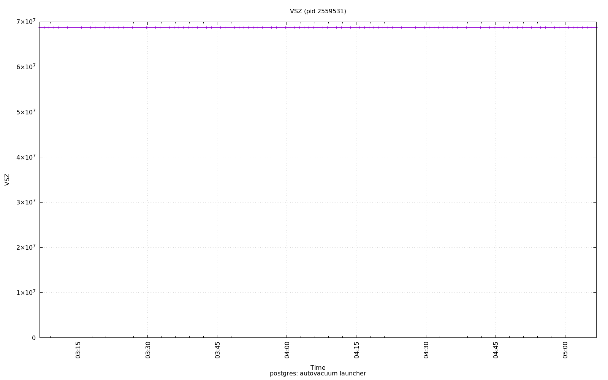

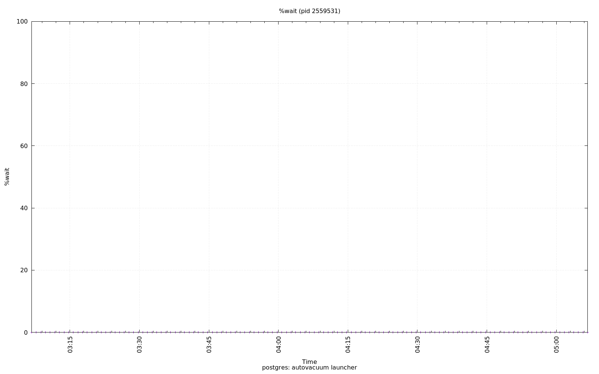
