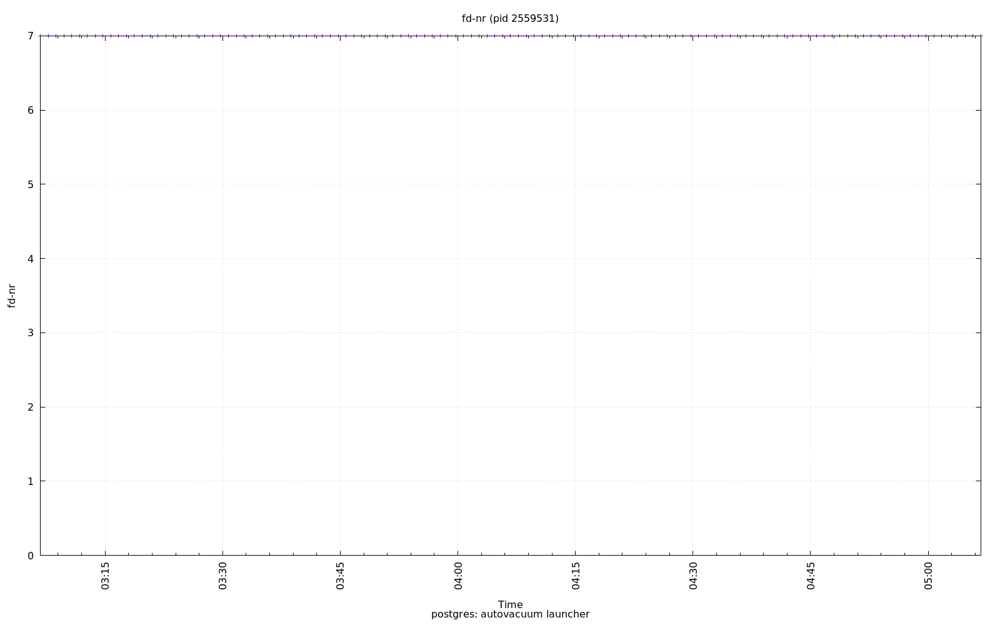

================================================================================
Database Test 7 pidstat autovacuum Charts
================================================================================

.. image:: ../pidstat/pidstat-2559531-RSS.png
   :target: ../pidstat/pidstat-2559531-RSS.png
   :width: 100%

