================================================================================
Database Test 7 pidstat checkpointer Charts
================================================================================

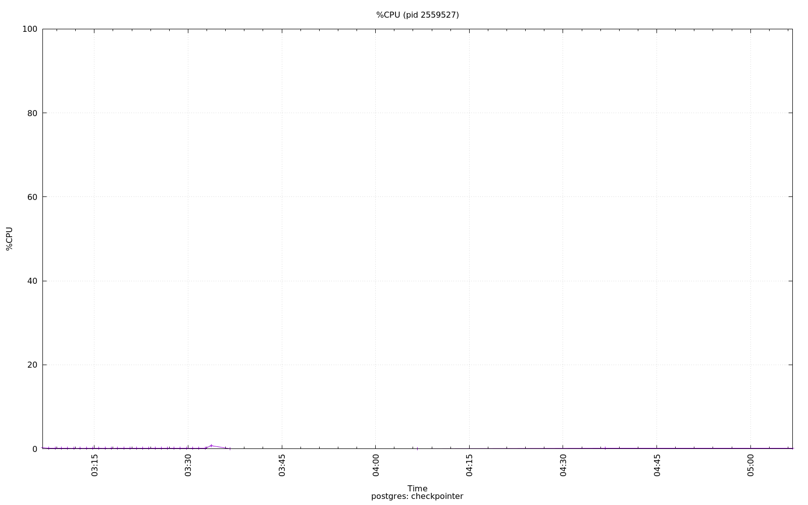

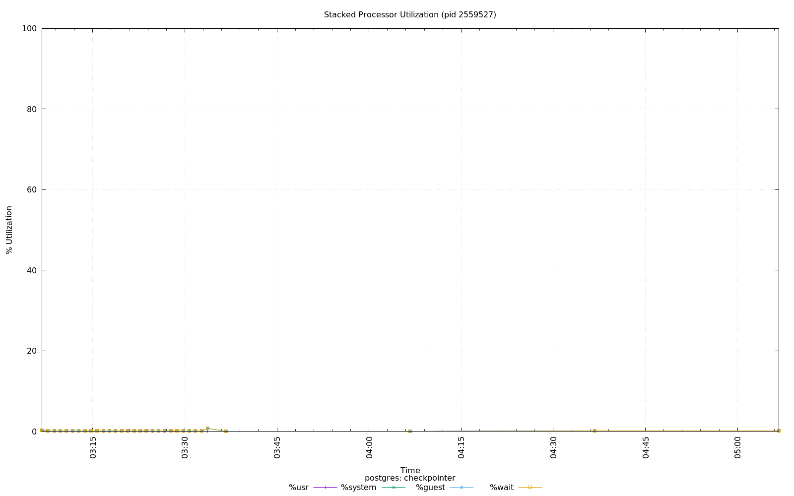

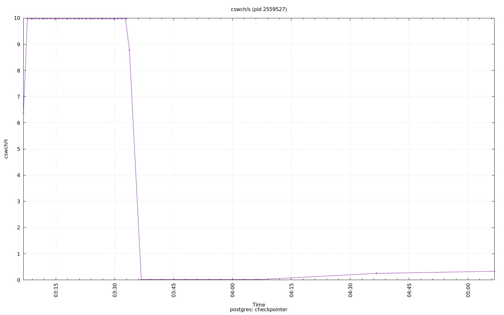

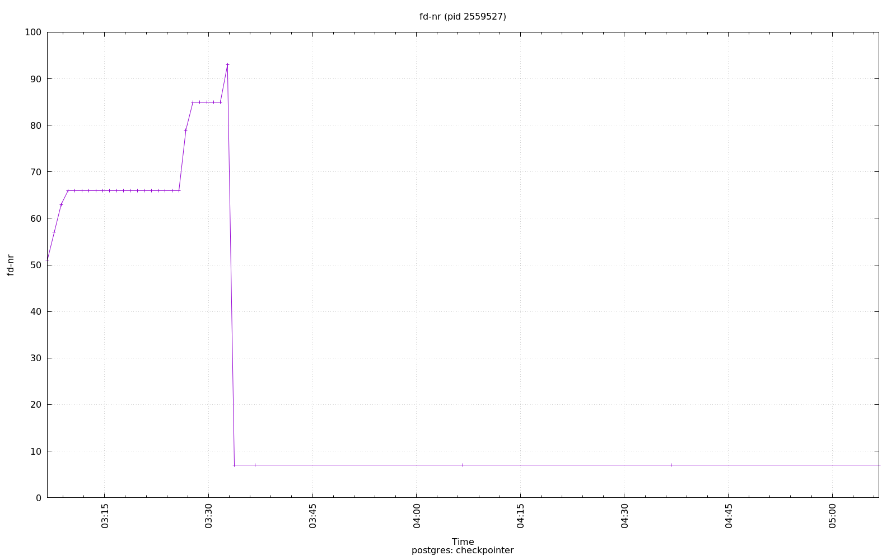

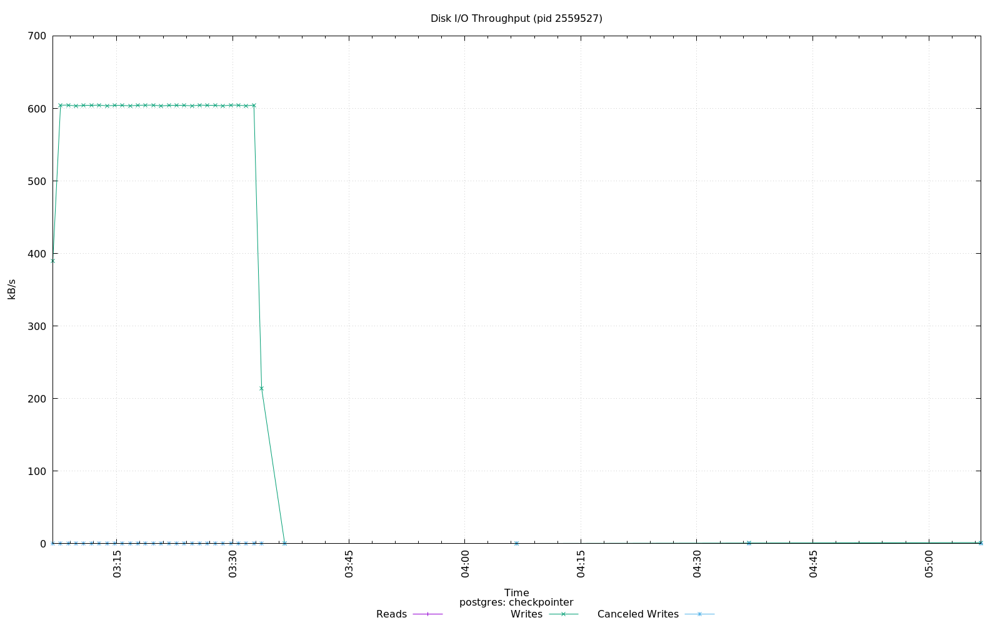

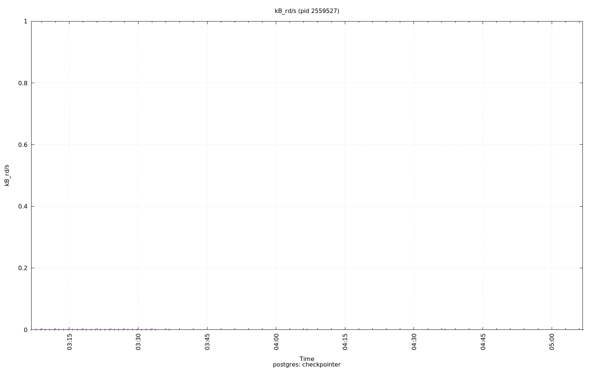

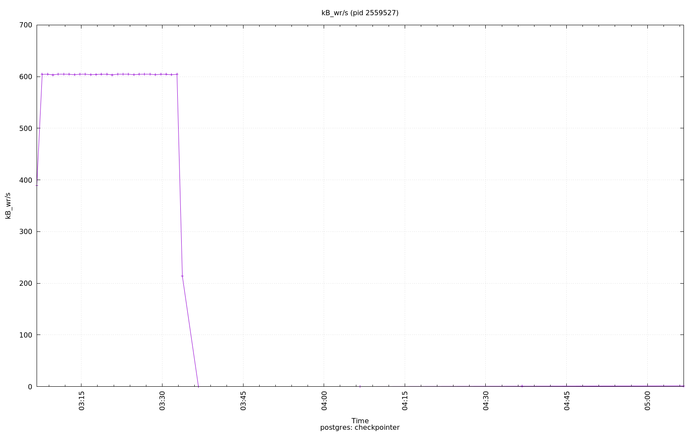

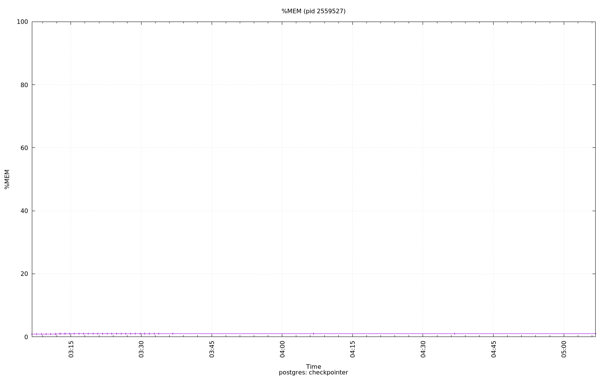

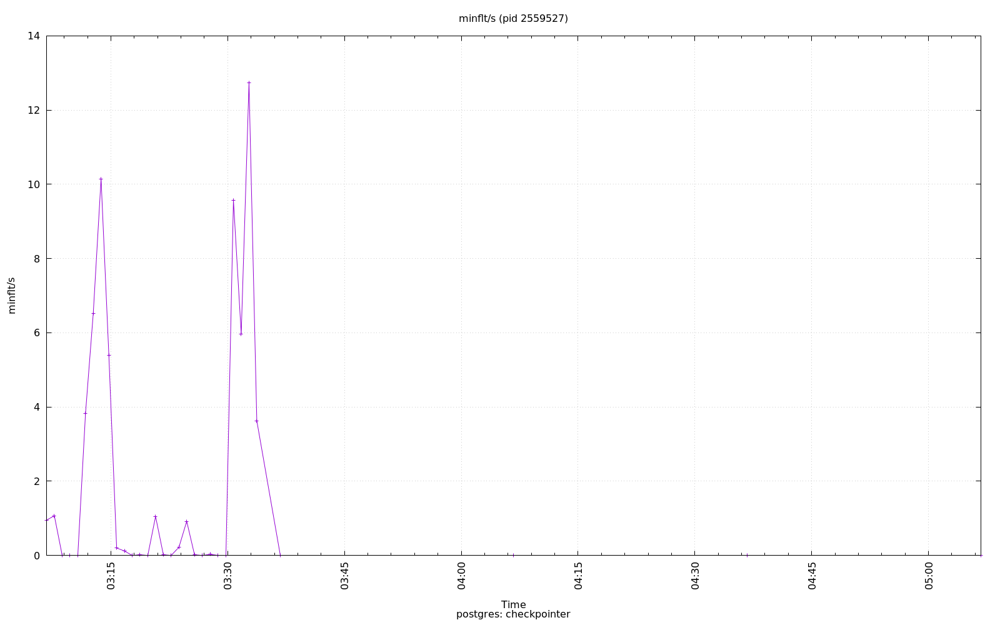

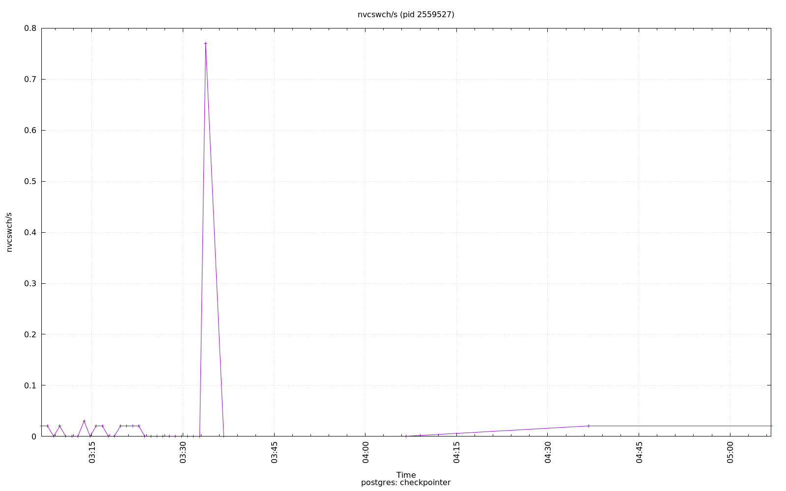

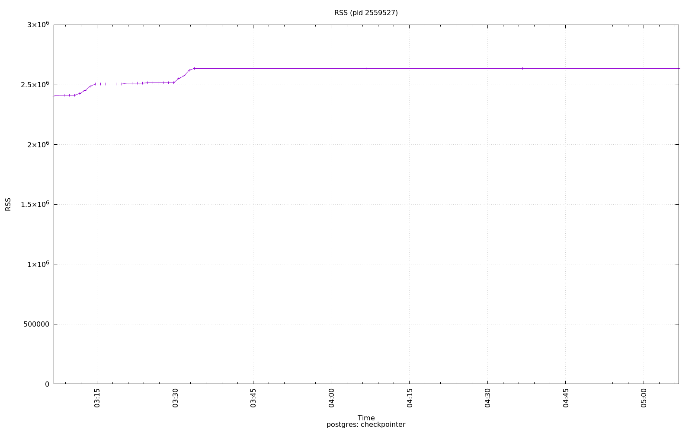

.. image:: ../pidstat/pidstat-2559527-StkRef.png
   :target: ../pidstat/pidstat-2559527-StkRef.png
   :width: 100%

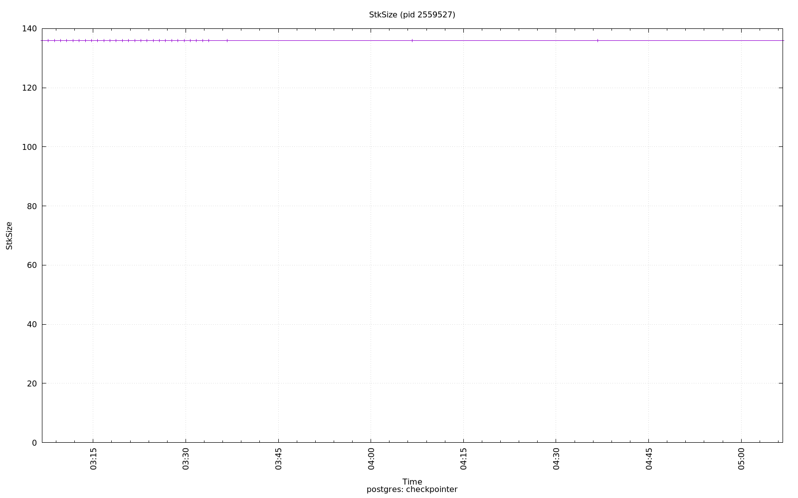

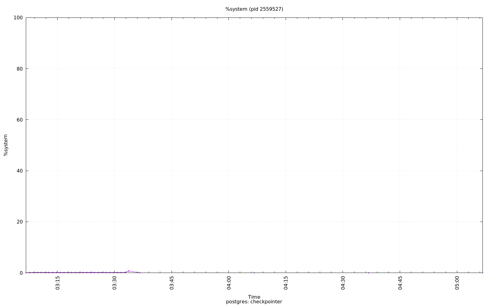

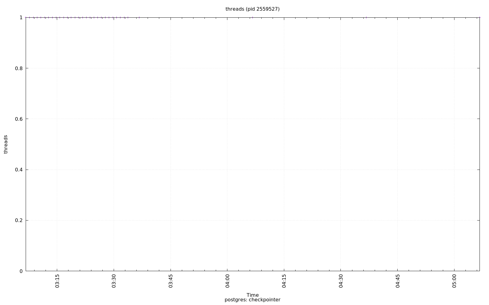

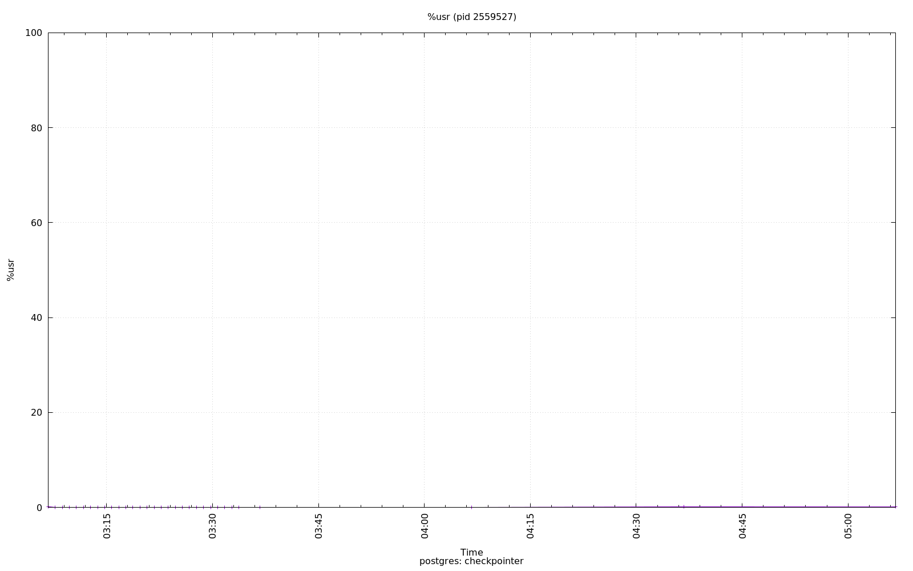

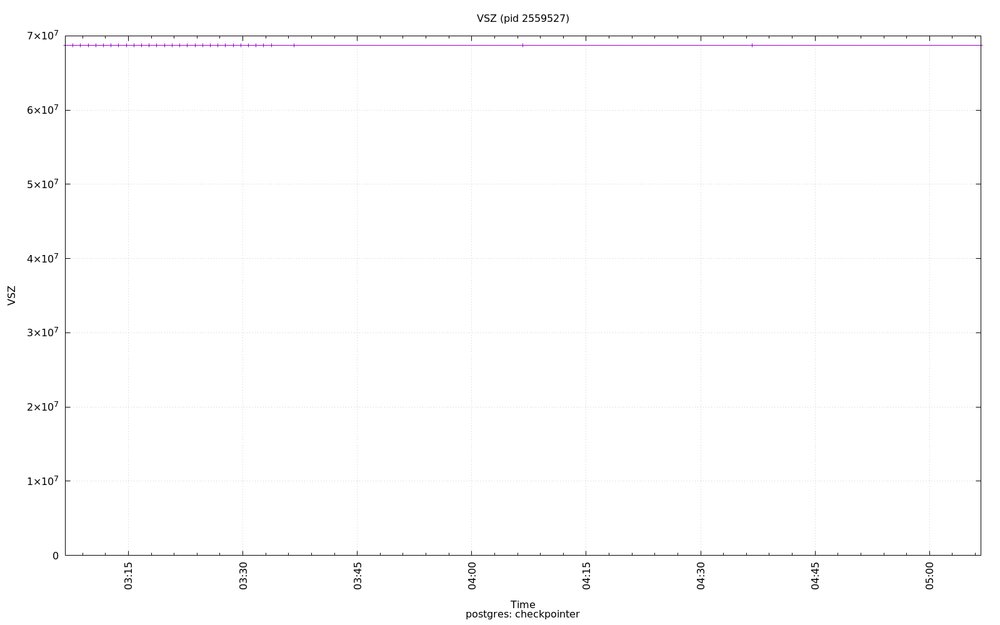

