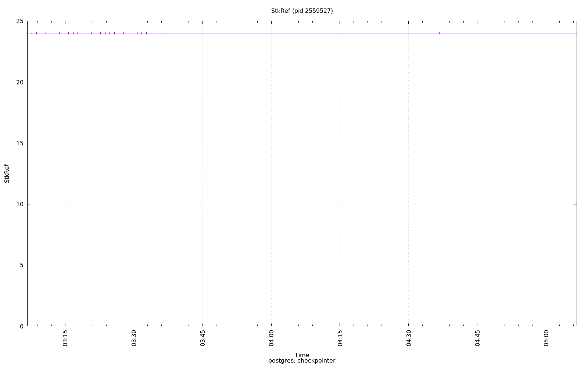

================================================================================
Database Test 7 pidstat checkpointer Charts
================================================================================

.. image:: ../pidstat/pidstat-2559527-guest.png
   :target: ../pidstat/pidstat-2559527-guest.png
   :width: 100%

