================================================================================
Database Test 7 pidstat logical Charts
================================================================================

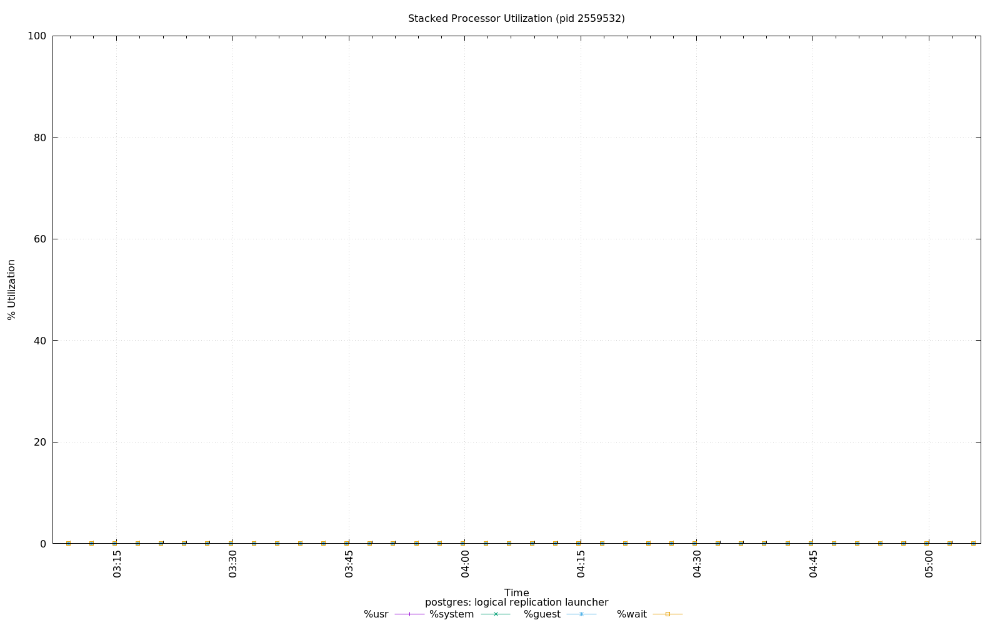

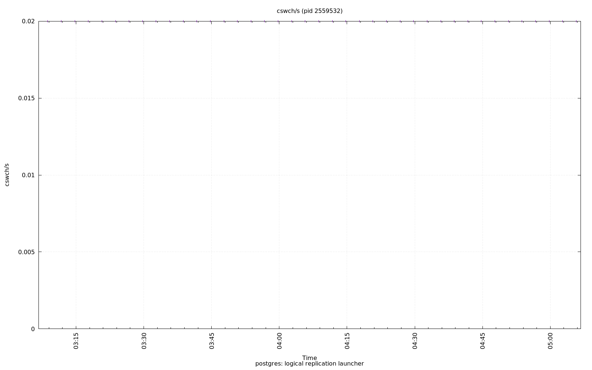

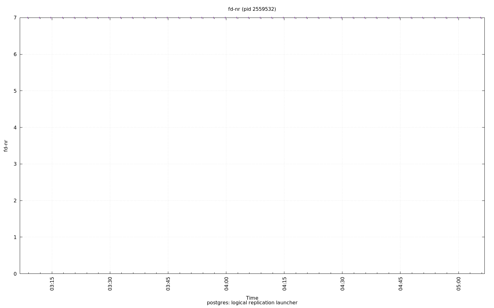

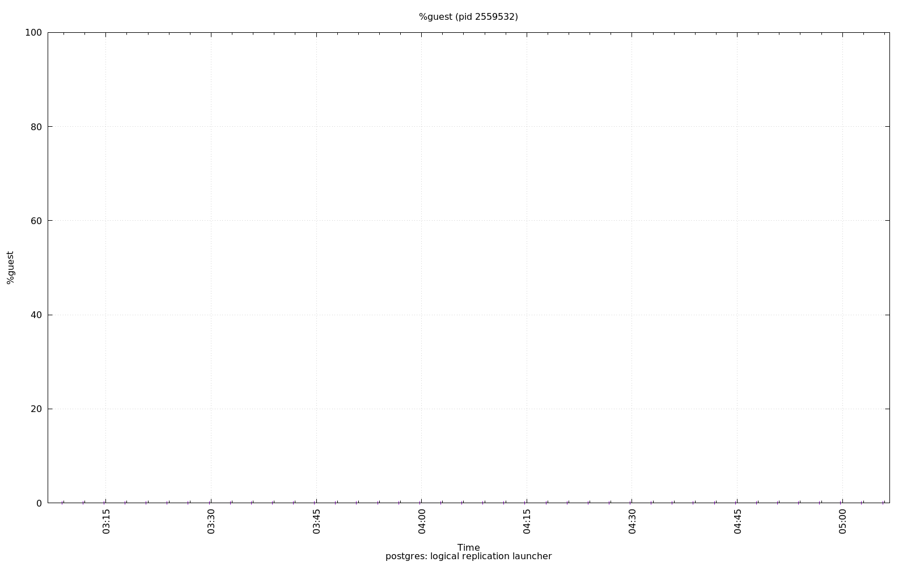

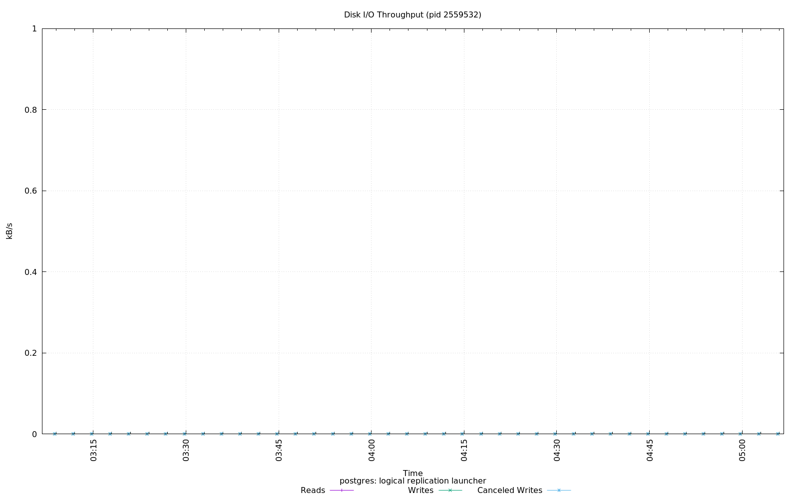

.. image:: ../pidstat/pidstat-2559532-kB_rd_s.png
   :target: ../pidstat/pidstat-2559532-kB_rd_s.png
   :width: 100%

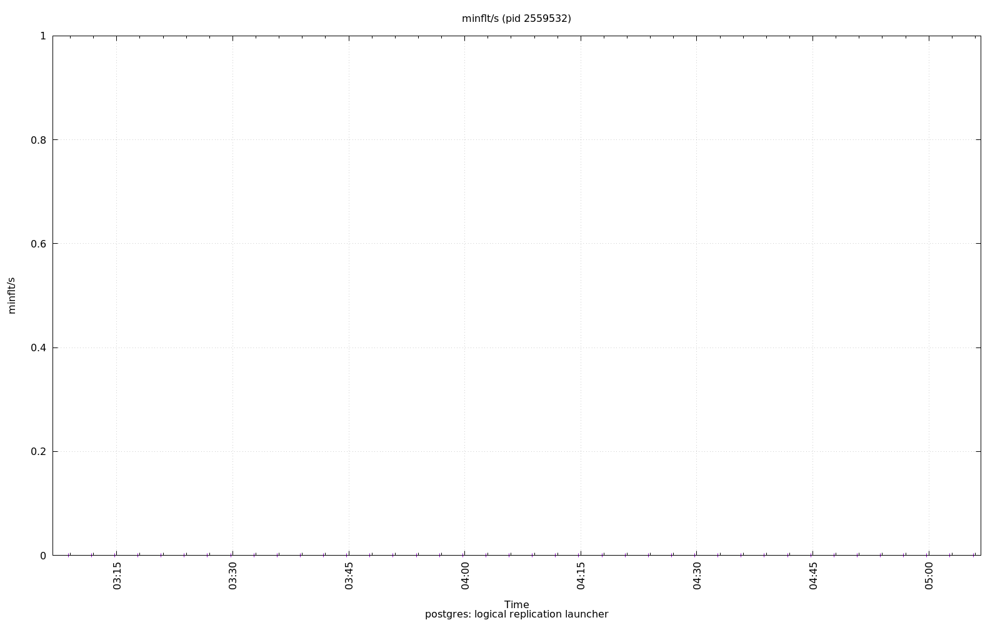

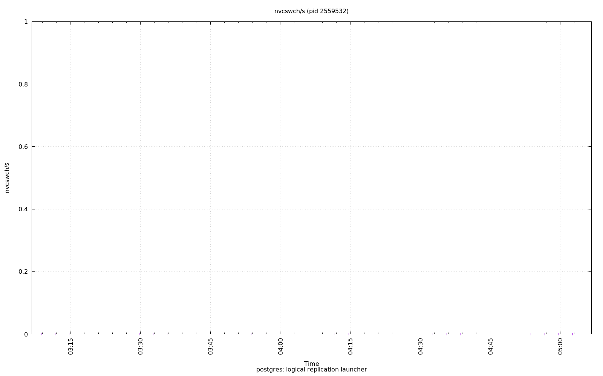

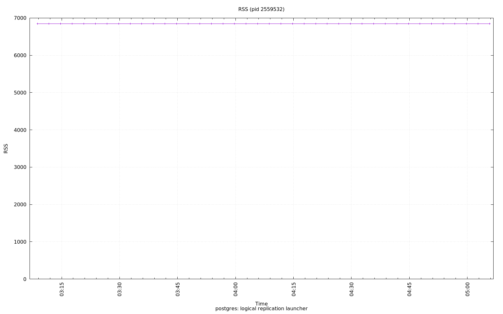

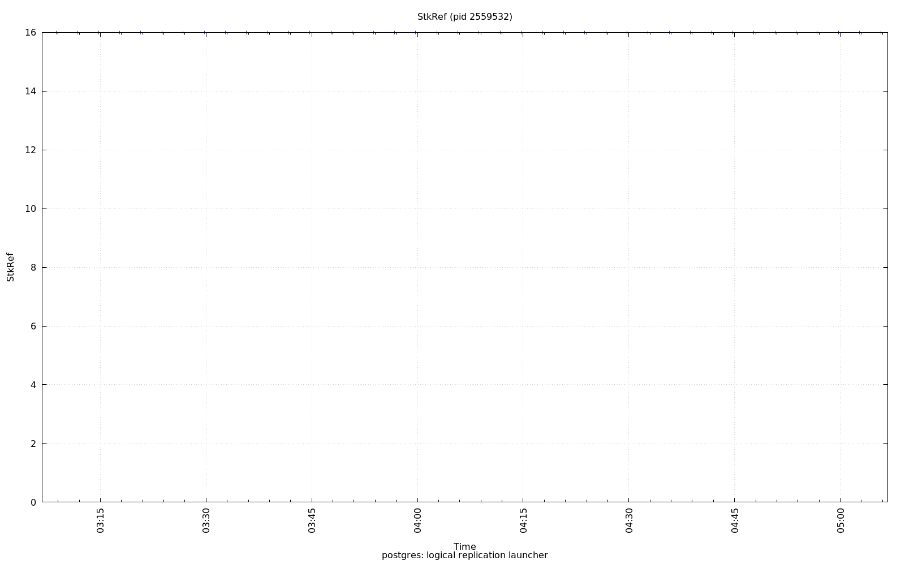

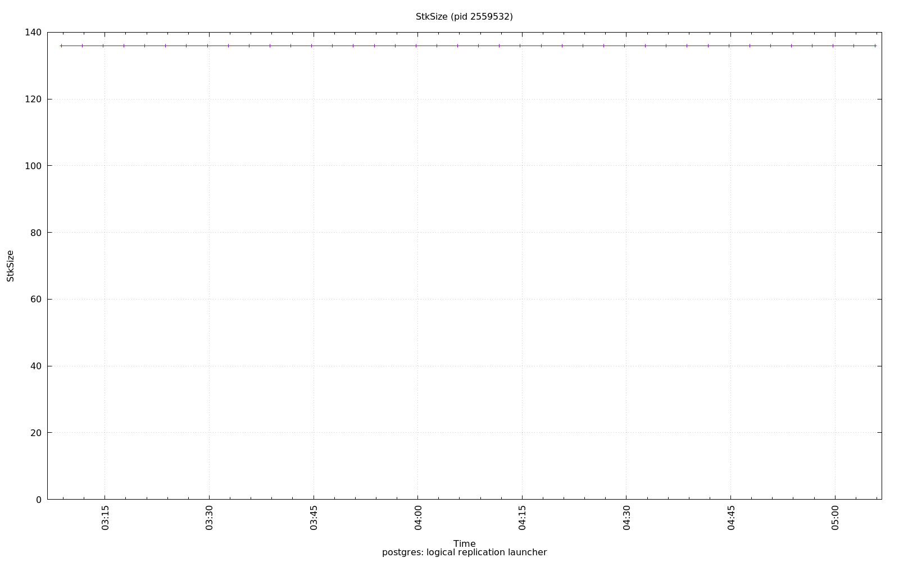

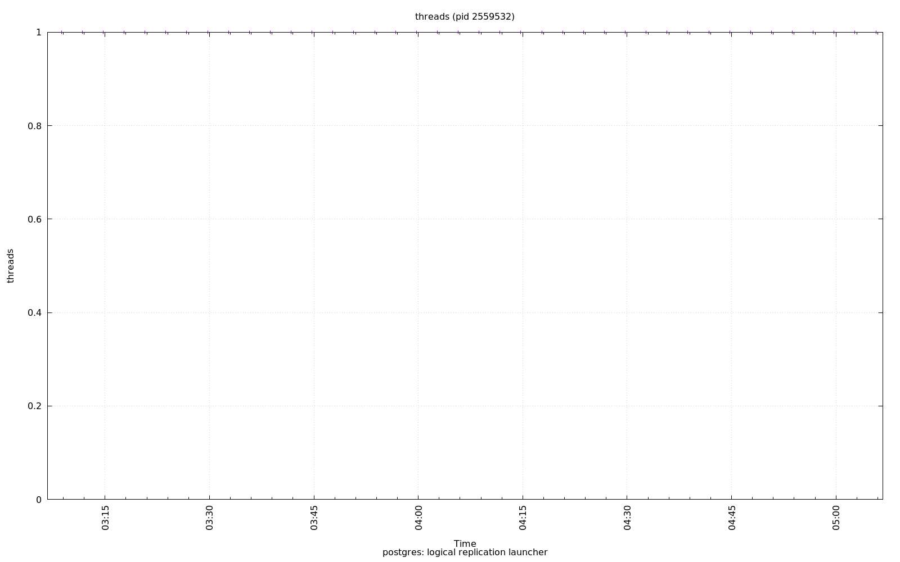

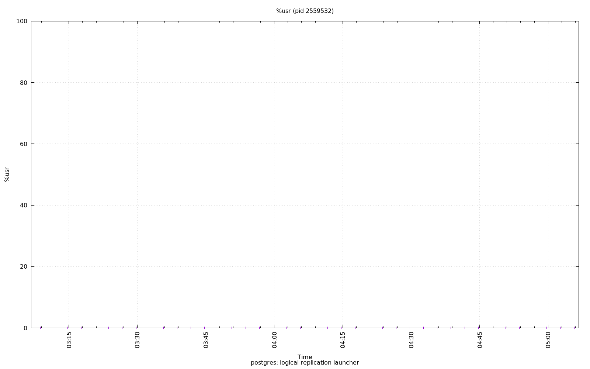

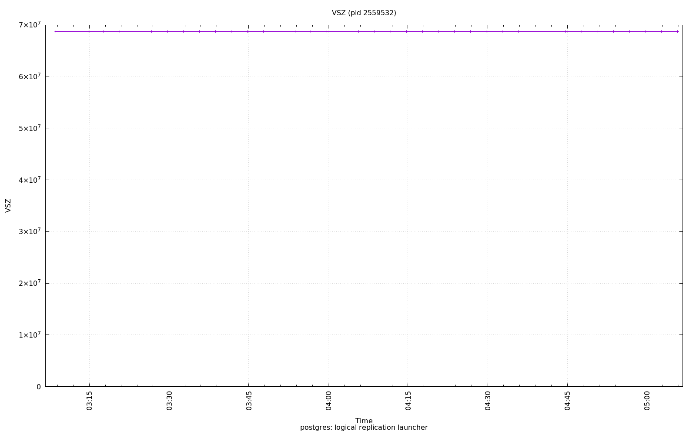

