================================================================================
Database Test 7 pidstat walwriter Charts
================================================================================

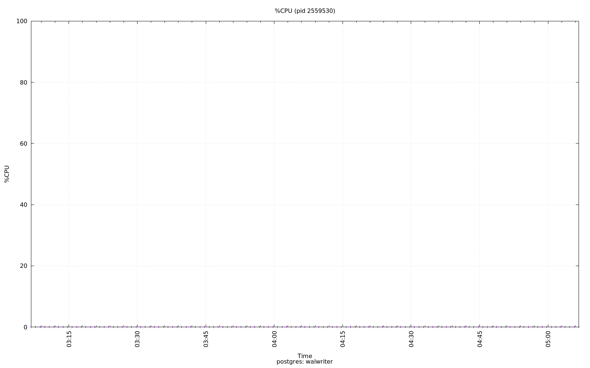

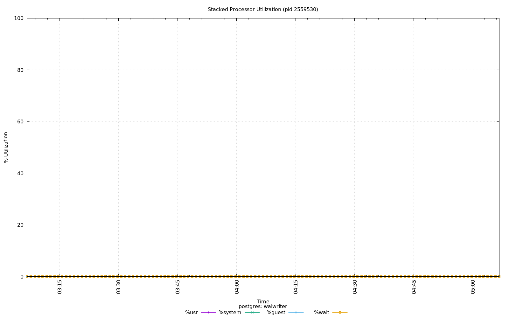

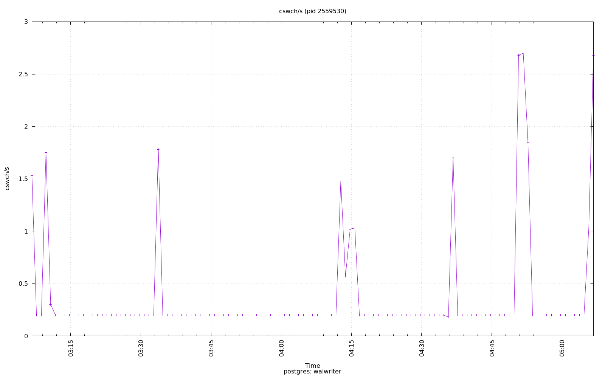

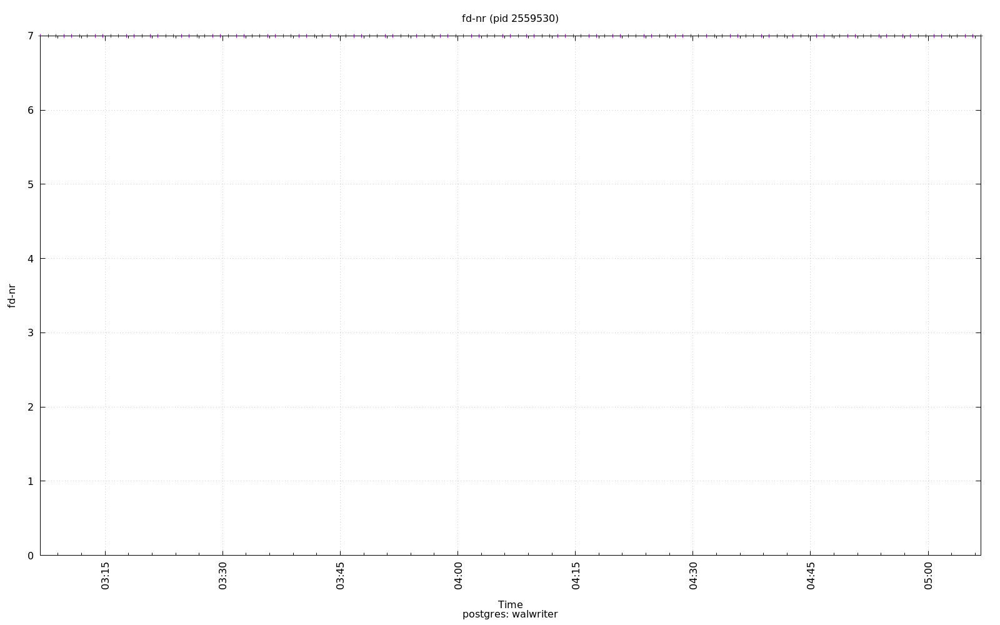

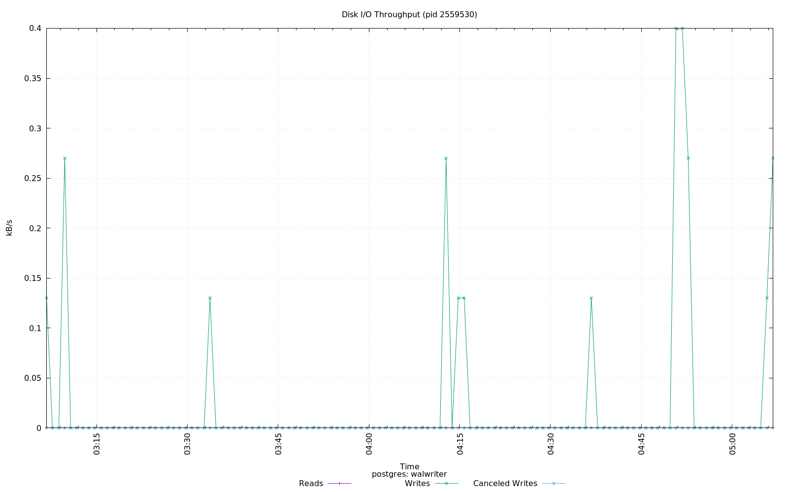

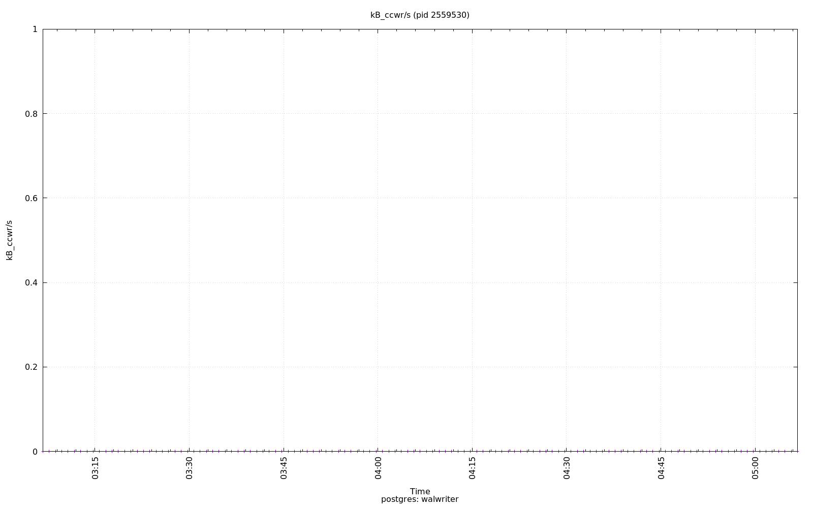

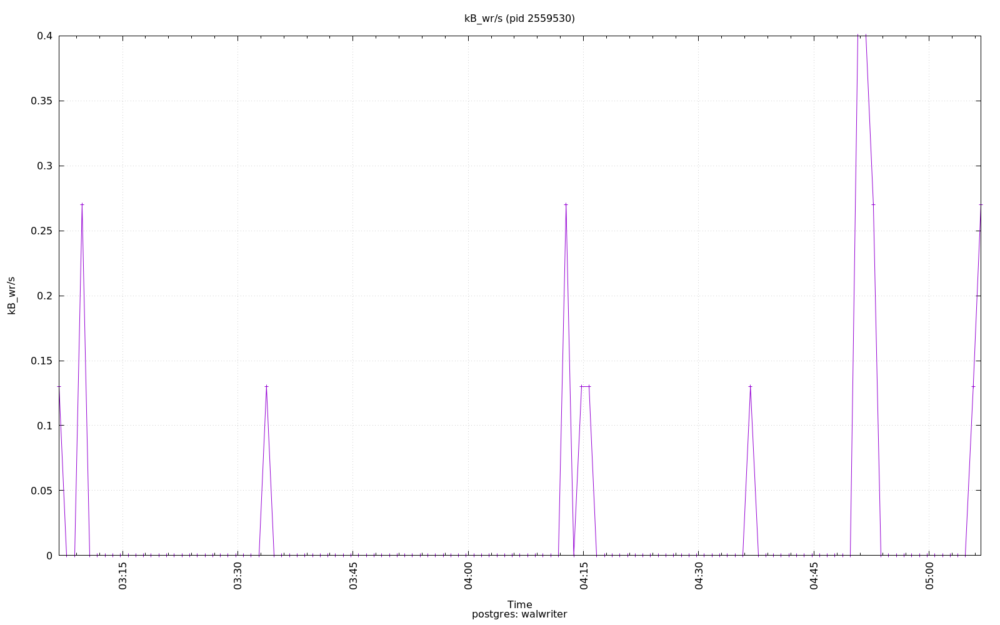

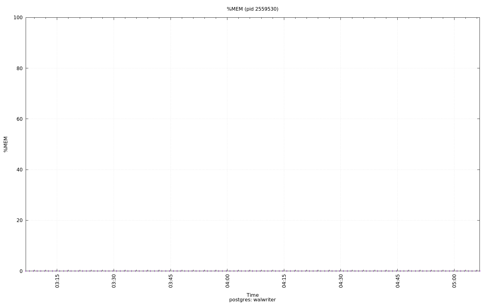

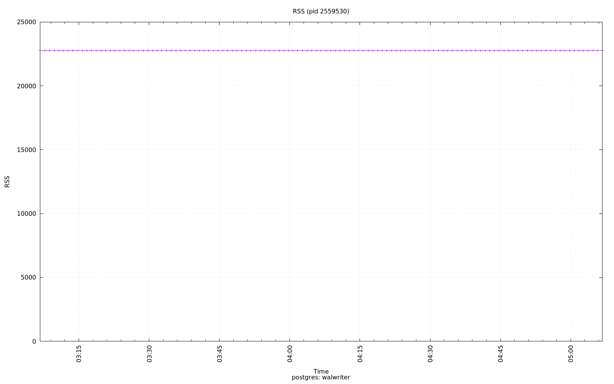

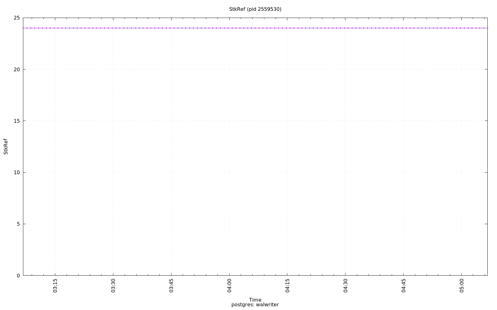

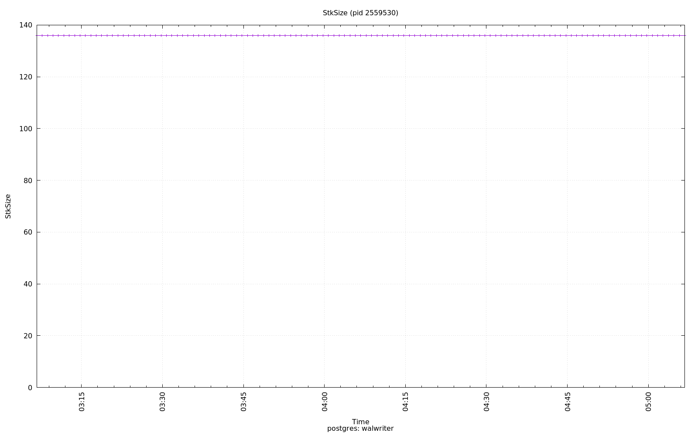

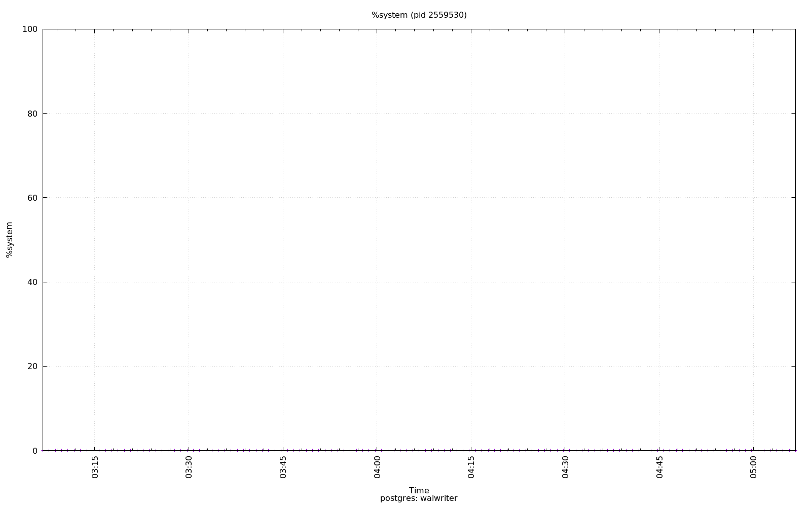

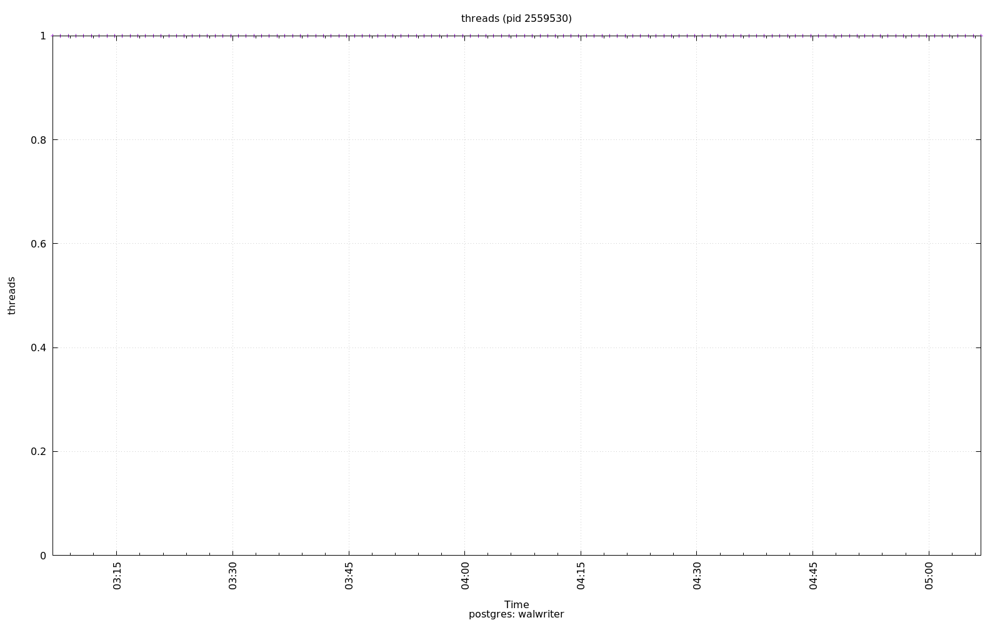

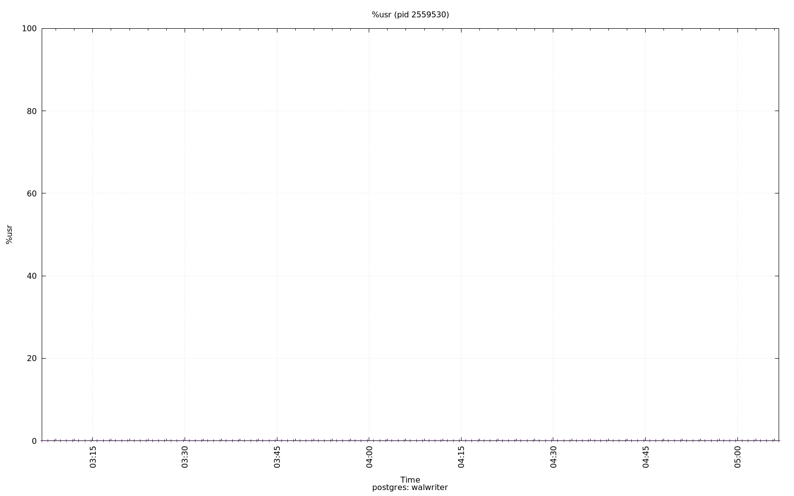

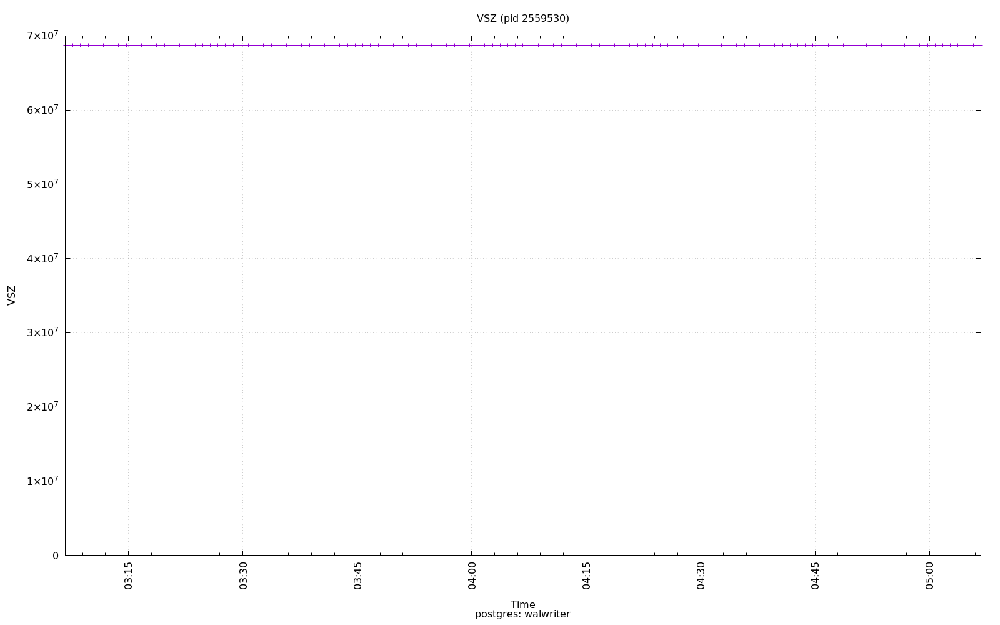

