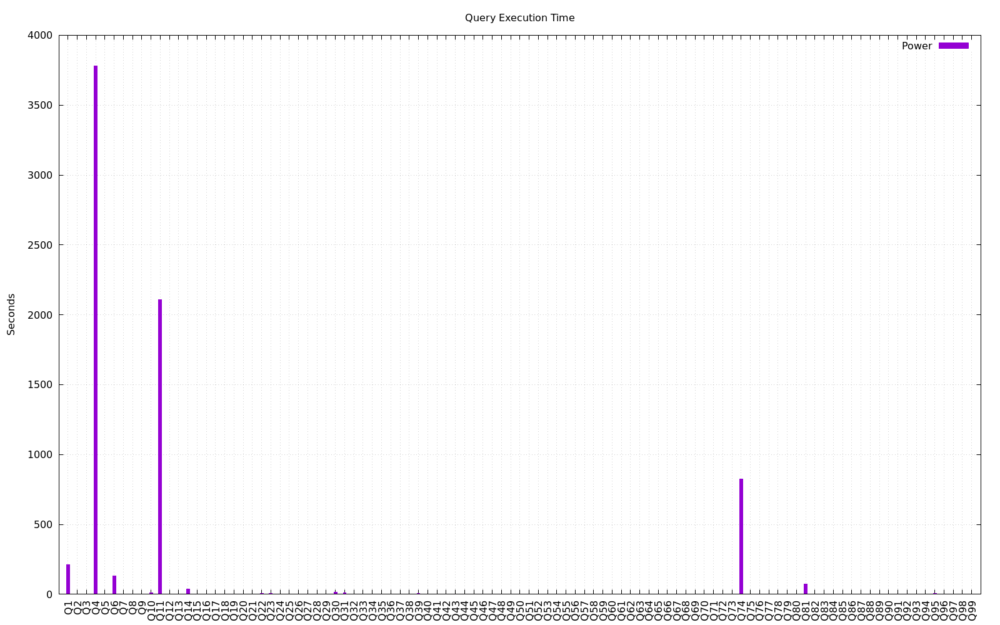

=======================
Database Test 7 Results
=======================

**These results are not comparable to TPC Benchmark(TM) DS Results.**

* Queries per Hour: 393
* Scale: 1
* Number of Query Streams: 4

Start and End Times
===================

=================  ====================  ====================  ================
Test               Start Timestamp       End Timestamp         Elapsed Time
=================  ====================  ====================  ================
Database Load      2024-06-27 03:05:05   2024-06-27 03:05:39   00:00:33.988806
Power Test         2024-06-27 03:05:43   2024-06-27 05:07:05   02:01:22.306909
Throughput Run 1   2024-06-27 05:07:08   2024-06-27 07:10:41   02:03:32.232196
Refresh Run 1      2024-06-27 07:10:41   2024-06-27 07:11:23   00:00:42.338813
Throughput Run 2   2024-06-27 07:11:23   2024-06-27 09:08:22   01:56:59.404055
Refresh Run 2      2024-06-27 09:08:22   2024-06-27 09:09:04   00:00:41.520357
=================  ====================  ====================  ================

Timing Intervals (in seconds)
=============================

==  =======  =======  =======  ========  =======  =======  =======  ========  =======  =======
 Q       Minimum       25th Percentile        Median        75th Percentile       Maximum
--  ----------------  -----------------  ----------------  -----------------  ----------------
 #   Run1     Run2     Run1      Run2     Run1     Run2     Run1      Run2     Run1     Run2
==  =======  =======  =======  ========  =======  =======  =======  ========  =======  =======
 1    208.6    199.0    209.6     202.2    209.9    203.5    214.8     205.5    214.8    205.5
 2      0.8      0.7      0.8       0.8      0.8      0.8      0.8       0.8      0.8      0.8
 3      0.0      0.0      0.0       0.0      0.0      0.0      0.0       0.0      0.0      0.0
 4   3730.9   3579.8   3779.5    3597.3   3780.5   3626.9   3794.7    3638.6   3794.7   3638.6
 5      2.5      2.5      2.5       2.5      2.5      2.5      2.6       2.5      2.6      2.5
 6    103.1     92.5    106.8      96.5    108.6    108.8    110.9     114.6    110.9    114.6
 7      1.0      1.0      1.0       1.0      1.0      1.0      1.0       1.0      1.0      1.0
 8      0.1      0.1      0.1       0.1      0.1      0.1      0.1       0.2      0.1      0.2
 9      2.2      2.2      2.2       2.2      2.3      2.3      2.3       2.3      2.3      2.3
10      7.2      7.7      8.1       7.9      8.4      8.0      8.6       8.7      8.6      8.7
11   2091.8   2029.6   2101.0    2051.3   2143.1   2058.2   2144.3    2062.7   2144.3   2062.7
12      0.0      0.0      0.0       0.0      0.0      0.0      0.0       0.0      0.0      0.0
13      0.3      0.3      0.3       0.3      0.3      0.3      0.3       0.3      0.3      0.3
14     29.3     29.2     29.5      29.2     36.2     34.3     38.5      37.0     38.5     37.0
15      0.2      0.2      0.2       0.2      0.2      0.2      0.2       0.2      0.2      0.2
16      0.6      0.4      0.6       0.5      0.7      0.7      0.8       1.8      0.8      1.8
17      1.2      1.2      1.2       2.7      2.7      2.7      2.8       2.7      2.8      2.7
18      0.7      0.7      0.7       0.7      0.7      0.7      0.8       0.7      0.8      0.7
19      0.2      0.1      0.2       0.2      0.2      0.2      0.2       0.2      0.2      0.2
20      0.0      0.0      0.1       0.0      0.1      0.0      0.1       0.1      0.1      0.1
21      0.6      0.6      0.6       0.7      0.7      0.7      0.7       0.7      0.7      0.7
22      4.8      4.8      4.9       4.9      4.9      4.9      4.9       5.0      4.9      5.0
23      7.6      9.3      9.5       9.3      9.5      9.3      9.6       9.4      9.6      9.4
24      0.0      0.0      0.8       1.2      0.9      1.2      1.6       1.6      1.6      1.6
25      1.4      1.5      1.5       1.6      1.8      1.8      1.8       1.8      1.8      1.8
26      0.6      0.6      0.7       0.6      0.7      0.6      0.7       0.6      0.7      0.6
27      0.9      0.8      0.9       0.9      0.9      0.9      0.9       0.9      0.9      0.9
28      1.6      1.6      1.6       1.6      1.6      1.6      1.6       1.6      1.6      1.6
29      0.7      1.1      1.1       1.1      1.1      1.2      1.1       1.3      1.1      1.3
30     15.6     14.9     16.1      15.0     16.6     16.0     17.3      16.1     17.3     16.1
31      9.0      8.9     10.9       9.5     11.0     10.5     11.1      11.2     11.1     11.2
32      0.0      0.0      0.0       0.0      0.0      0.0      0.0       0.0      0.0      0.0
33      0.2      0.2      0.2       0.2      0.2      0.2      0.2       0.2      0.2      0.2
34      0.4      0.4      0.4       0.4      0.4      0.4      0.4       0.4      0.4      0.4
35      0.5      0.5      0.5       0.5      0.5      0.5      0.6       0.5      0.6      0.5
36      1.1      1.1      1.1       1.1      1.1      1.1      1.1       1.1      1.1      1.1
37      0.0      0.0      0.0       0.0      0.0      0.0      0.0       0.0      0.0      0.0
38      2.2      2.2      2.2       2.2      2.2      2.2      2.2       2.2      2.2      2.2
39      4.9      4.9      4.9       5.2      5.0      5.2      5.0       5.4      5.0      5.4
40      0.1      0.1      0.1       0.1      0.1      0.1      0.1       0.1      0.1      0.1
41      0.6      0.9      1.0       0.9      1.0      0.9      1.0       1.0      1.0      1.0
42      0.2      0.2      0.2       0.2      0.2      0.2      0.2       0.2      0.2      0.2
43      0.5      0.5      0.5       0.5      0.5      0.5      0.5       0.5      0.5      0.5
44      0.3      0.2      1.0       0.2      1.0      1.0      1.0       1.0      1.0      1.0
45      0.1      0.1      0.1       0.1      0.1      0.1      0.1       0.1      0.1      0.1
46      0.5      0.5      0.5       0.5      0.5      0.5      0.5       0.5      0.5      0.5
47      1.9      1.8      1.9       1.8      1.9      1.9      1.9       1.9      1.9      1.9
48      0.5      0.5      0.5       0.5      0.5      0.5      0.5       0.5      0.5      0.5
49      0.1      0.1      0.1       0.1      0.1      0.1      0.1       0.1      0.1      0.1
50      0.0      0.0      0.0       0.0      0.0      0.0      0.0       0.1      0.0      0.1
51      1.4      1.4      1.4       1.4      1.4      1.4      1.4       1.4      1.4      1.4
52      0.2      0.2      0.2       0.2      0.2      0.2      0.2       0.2      0.2      0.2
53      0.2      0.2      0.2       0.2      0.2      0.2      0.2       0.3      0.2      0.3
54      0.2      0.2      0.2       0.4      0.2      0.4      0.4       0.4      0.4      0.4
55      0.0      0.0      0.0       0.0      0.2      0.1      0.2       0.2      0.2      0.2
56      0.5      0.5      0.5       0.5      0.6      0.5      0.6       0.6      0.6      0.6
57      1.5      1.6      1.6       1.6      1.6      1.6      1.6       1.7      1.6      1.7
58      0.1      0.1      0.1       0.1      0.1      0.1      0.1       0.1      0.1      0.1
59      0.9      0.9      0.9       0.9      0.9      0.9      1.0       1.0      1.0      1.0
60      0.3      0.4      0.4       0.4      0.4      0.4      0.4       0.9      0.4      0.9
61      0.0      0.0      0.0       0.0      0.0      0.0      0.0       0.0      0.0      0.0
62      0.2      0.2      0.2       0.2      0.2      0.2      0.2       0.2      0.2      0.2
63      0.2      0.2      0.2       0.2      0.2      0.2      0.2       0.2      0.2      0.2
64      0.5      0.5      0.5       0.5      0.5      0.5      1.8       0.6      1.8      0.6
65      1.1      1.1      1.1       1.1      1.1      1.1      1.1       1.2      1.1      1.2
66      0.4      0.4      0.4       0.4      0.4      0.4      0.5       0.5      0.5      0.5
67      2.1      1.7      2.1       2.0      2.1      2.1      2.1       2.1      2.1      2.1
68      0.3      0.3      0.3       0.3      0.3      0.3      0.3       0.3      0.3      0.3
69      0.1      0.0      0.1       0.0      0.1      0.0      0.1       0.1      0.1      0.1
70      1.0      1.0      1.0       1.0      1.0      1.0      1.0       1.2      1.0      1.2
71      0.3      0.3      0.3       0.3      0.3      0.4      0.3       0.4      0.3      0.4
72      0.5      0.5      0.5       0.5      0.5      0.5      0.6       0.5      0.6      0.5
73      0.2      0.2      0.2       0.2      0.2      0.2      0.2       0.3      0.2      0.3
74    808.3    658.8    820.7     663.3    830.6    787.8    842.4     788.8    842.4    788.8
75      1.6      1.6      1.6       1.6      1.6      1.6      1.7       1.6      1.7      1.6
76      0.5      0.5      0.5       0.5      0.5      0.5      0.5       0.5      0.5      0.5
77      0.2      0.2      0.2       0.2      0.2      0.2      0.2       0.2      0.2      0.2
78      2.6      2.6      2.6       2.6      3.0      2.6      3.0       3.0      3.0      3.0
79      0.2      0.2      0.2       0.2      0.3      0.2      0.3       0.2      0.3      0.2
80      0.3      0.3      0.3       0.3      0.3      0.3      0.3       0.3      0.3      0.3
81     71.2     12.8     71.3      69.5     73.3     70.6     73.5      72.2     73.5     72.2
82      0.0      0.0      0.0       0.0      0.0      0.0      0.0       0.0      0.0      0.0
83      0.1      0.1      0.1       0.1      0.1      0.1      0.1       0.1      0.1      0.1
84      0.1      0.1      0.1       0.1      0.1      0.1      0.1       0.1      0.1      0.1
85      0.1      0.1      0.1       0.1      0.1      0.1      0.1       0.1      0.1      0.1
86      0.3      0.3      0.3       0.3      0.3      0.3      0.3       0.3      0.3      0.3
87      2.2      2.2      2.2       2.2      2.2      2.2      2.2       2.2      2.2      2.2
88      2.1      2.1      2.1       2.1      2.1      2.1      2.1       2.2      2.1      2.2
89      0.5      0.4      0.6       0.6      0.6      0.6      0.8       0.7      0.8      0.7
90      0.0      0.0      0.0       0.0      0.0      0.0      0.0       0.0      0.0      0.0
91      0.0      0.0      0.0       0.0      0.0      0.0      0.0       0.0      0.0      0.0
92      0.0      0.0      0.0       0.0      0.0      0.0      0.0       0.0      0.0      0.0
93      0.0      0.0      0.1       0.1      0.1      0.1      0.1       0.1      0.1      0.1
94      0.1      0.2      0.1       0.2      0.2      0.2      0.2       0.2      0.2      0.2
95      7.6     13.6     31.8      34.4     45.7     58.0     94.1      70.9     94.1     70.9
96      0.3      0.3      0.3       0.3      0.3      0.3      0.3       0.3      0.3      0.3
97      1.0      0.9      1.0       1.0      1.0      1.0      1.0       1.0      1.0      1.0
98      0.1      0.1      0.1       0.1      0.1      0.1      0.1       0.1      0.1      0.1
99      0.4      0.4      0.4       0.4      0.4      0.4      0.4       0.4      0.4      0.4
==  =======  =======  =======  ========  =======  =======  =======  ========  =======  =======

Power Test
==========

System Configuration
====================

Hardware Information
--------------------

* CPU Type:   AMD EPYC 7502P 32-Core Processor
* Total Processors:  64
* Memory:         263504836 kB KB RAM

Software Information
--------------------

* Operating System:  "Debian GNU/Linux 12 (bookworm)"  Linux 6.1.0-21-amd64
* Database Server: PostgreSQL 15.6 (Debian 15.6-0+deb12u1) on x86_64-pc-linux-gnu, compiled by gcc (Debian 12.2.0-14) 12.2.0, 64-bit

System Statistics
=================

Load Test
---------

* Charts: `CPU <load/cpu/>`__ `Memory <load/mem/>`__ `Blockdev <load/blockdev/>`__ `Network <load/net/>`__ `Paging <load/paging/>`__ `Swap <load/swap/>`__

Power Test
----------

* Charts: `CPU <power/cpu/>`__ `Memory <power/mem/>`__ `Blockdev <power/blockdev/>`__ `Network <power/net/>`__ `Paging <power/paging/>`__ `Swap <power/swap/>`__

Throughput Test
---------------

* Charts: `CPU <throughput/cpu/>`__ `Memory <throughput/mem/>`__ `Blockdev <throughput/blockdev/>`__ `Network <throughput/net/>`__ `Paging <throughput/paging/>`__ `Swap <throughput/swap/>`__

PostgreSQL Report
=================

Load Test
--------------------------------------------------------------------------------

* `Database Settings <load/dbstat/params.csv>`__
* Per Process Statistics:  `autovacuum <load/sysstat/autovacuum/>`__ `bgwriter <load/sysstat/bgwriter/>`__ `checkpointer <load/sysstat/checkpointer/>`__ `logger <load/sysstat/logger/>`__ `logical <load/sysstat/logical/>`__ `statscollector <load/sysstat/statscollector/>`__ `walwriter <load/sysstat/walwriter/>`__

.. list-table::

   * - Database Stats Charts
     - `dbt7 <load/dbstat/db/dbt7>`__
   * - Database Table Stats Charts:
     - `public.call_center <load/dbstat/table/public.call_center/>`__ `public.catalog_page <load/dbstat/table/public.catalog_page/>`__ `public.catalog_returns <load/dbstat/table/public.catalog_returns/>`__ `public.catalog_sales <load/dbstat/table/public.catalog_sales/>`__ `public.customer <load/dbstat/table/public.customer/>`__ `public.customer_address <load/dbstat/table/public.customer_address/>`__ `public.customer_demographics <load/dbstat/table/public.customer_demographics/>`__ `public.date_dim <load/dbstat/table/public.date_dim/>`__ `public.household_demographics <load/dbstat/table/public.household_demographics/>`__ `public.income_band <load/dbstat/table/public.income_band/>`__ `public.inventory <load/dbstat/table/public.inventory/>`__ `public.item <load/dbstat/table/public.item/>`__ `public.promotion <load/dbstat/table/public.promotion/>`__ `public.reason <load/dbstat/table/public.reason/>`__ `public.s_catalog_order <load/dbstat/table/public.s_catalog_order/>`__ `public.s_catalog_order_lineitem <load/dbstat/table/public.s_catalog_order_lineitem/>`__ `public.s_catalog_returns <load/dbstat/table/public.s_catalog_returns/>`__ `public.s_inventory <load/dbstat/table/public.s_inventory/>`__ `public.s_purchase <load/dbstat/table/public.s_purchase/>`__ `public.s_purchase_lineitem <load/dbstat/table/public.s_purchase_lineitem/>`__ `public.s_store_returns <load/dbstat/table/public.s_store_returns/>`__ `public.s_web_order <load/dbstat/table/public.s_web_order/>`__ `public.s_web_order_lineitem <load/dbstat/table/public.s_web_order_lineitem/>`__ `public.s_web_returns <load/dbstat/table/public.s_web_returns/>`__ `public.ship_mode <load/dbstat/table/public.ship_mode/>`__ `public.store <load/dbstat/table/public.store/>`__ `public.store_returns <load/dbstat/table/public.store_returns/>`__ `public.store_sales <load/dbstat/table/public.store_sales/>`__ `public.time_dim <load/dbstat/table/public.time_dim/>`__ `public.time_statistics <load/dbstat/table/public.time_statistics/>`__ `public.warehouse <load/dbstat/table/public.warehouse/>`__ `public.web_page <load/dbstat/table/public.web_page/>`__ `public.web_returns <load/dbstat/table/public.web_returns/>`__ `public.web_sales <load/dbstat/table/public.web_sales/>`__ `public.web_site <load/dbstat/table/public.web_site/>`__ 
   * - Database Index Stats Charts:
     - 
   * - Database Tables by Metric:
     - `analyze_count <load/dbstat/table-stat/t_analyze_count/>`__ `autoanalyze_count <load/dbstat/table-stat/t_autoanalyze_count/>`__ `autovacuum_count <load/dbstat/table-stat/t_autovacuum_count/>`__ `heap_blks_hit <load/dbstat/table-stat/t_heap_blks_hit/>`__ `heap_blks_read <load/dbstat/table-stat/t_heap_blks_read/>`__ `idx_blks_hit <load/dbstat/table-stat/t_idx_blks_hit/>`__ `idx_blks_read <load/dbstat/table-stat/t_idx_blks_read/>`__ `idx_scan <load/dbstat/table-stat/t_idx_scan/>`__ `idx_tup_fetch <load/dbstat/table-stat/t_idx_tup_fetch/>`__ `n_dead_tup <load/dbstat/table-stat/t_n_dead_tup/>`__ `n_ins_since_vacuum <load/dbstat/table-stat/t_n_ins_since_vacuum/>`__ `n_live_tup <load/dbstat/table-stat/t_n_live_tup/>`__ `n_mod_since_analyze <load/dbstat/table-stat/t_n_mod_since_analyze/>`__ `n_tup_del <load/dbstat/table-stat/t_n_tup_del/>`__ `n_tup_hot_upd <load/dbstat/table-stat/t_n_tup_hot_upd/>`__ `n_tup_ins <load/dbstat/table-stat/t_n_tup_ins/>`__ `n_tup_upd <load/dbstat/table-stat/t_n_tup_upd/>`__ `seq_scan <load/dbstat/table-stat/t_seq_scan/>`__ `seq_tup_read <load/dbstat/table-stat/t_seq_tup_read/>`__ `tidx_blks_hit <load/dbstat/table-stat/t_tidx_blks_hit/>`__ `tidx_blks_read <load/dbstat/table-stat/t_tidx_blks_read/>`__ `toast_blks_hit <load/dbstat/table-stat/t_toast_blks_hit/>`__ `toast_blks_read <load/dbstat/table-stat/t_toast_blks_read/>`__ `vacuum_count <load/dbstat/table-stat/t_vacuum_count/>`__ 
   * - Database Indexs by Metric:
     - `idx_blks_hit <load/dbstat/index-stat/i_idx_blks_hit/>`__ `idx_blks_read <load/dbstat/index-stat/i_idx_blks_read/>`__ `idx_scan <load/dbstat/index-stat/i_idx_scan/>`__ `idx_tup_fetch <load/dbstat/index-stat/i_idx_tup_fetch/>`__ `idx_tup_read <load/dbstat/index-stat/i_idx_tup_read/>`__ 

Power Test
--------------------------------------------------------------------------------

* `Database Settings <power/dbstat/params.csv>`__
* Per Process Statistics:  `autovacuum <power/sysstat/autovacuum/>`__ `bgwriter <power/sysstat/bgwriter/>`__ `checkpointer <power/sysstat/checkpointer/>`__ `logger <power/sysstat/logger/>`__ `logical <power/sysstat/logical/>`__ `statscollector <power/sysstat/statscollector/>`__ `walwriter <power/sysstat/walwriter/>`__

.. list-table::

   * - Database Stats Charts
     - `dbt7 <power/dbstat/db/dbt7>`__
   * - Database Table Stats Charts:
     - `public.call_center <power/dbstat/table/public.call_center/>`__ `public.catalog_page <power/dbstat/table/public.catalog_page/>`__ `public.catalog_returns <power/dbstat/table/public.catalog_returns/>`__ `public.catalog_sales <power/dbstat/table/public.catalog_sales/>`__ `public.customer <power/dbstat/table/public.customer/>`__ `public.customer_address <power/dbstat/table/public.customer_address/>`__ `public.customer_demographics <power/dbstat/table/public.customer_demographics/>`__ `public.date_dim <power/dbstat/table/public.date_dim/>`__ `public.household_demographics <power/dbstat/table/public.household_demographics/>`__ `public.income_band <power/dbstat/table/public.income_band/>`__ `public.inventory <power/dbstat/table/public.inventory/>`__ `public.item <power/dbstat/table/public.item/>`__ `public.promotion <power/dbstat/table/public.promotion/>`__ `public.reason <power/dbstat/table/public.reason/>`__ `public.s_catalog_order <power/dbstat/table/public.s_catalog_order/>`__ `public.s_catalog_order_lineitem <power/dbstat/table/public.s_catalog_order_lineitem/>`__ `public.s_catalog_returns <power/dbstat/table/public.s_catalog_returns/>`__ `public.s_inventory <power/dbstat/table/public.s_inventory/>`__ `public.s_purchase <power/dbstat/table/public.s_purchase/>`__ `public.s_purchase_lineitem <power/dbstat/table/public.s_purchase_lineitem/>`__ `public.s_store_returns <power/dbstat/table/public.s_store_returns/>`__ `public.s_web_order <power/dbstat/table/public.s_web_order/>`__ `public.s_web_order_lineitem <power/dbstat/table/public.s_web_order_lineitem/>`__ `public.s_web_returns <power/dbstat/table/public.s_web_returns/>`__ `public.ship_mode <power/dbstat/table/public.ship_mode/>`__ `public.store <power/dbstat/table/public.store/>`__ `public.store_returns <power/dbstat/table/public.store_returns/>`__ `public.store_sales <power/dbstat/table/public.store_sales/>`__ `public.time_dim <power/dbstat/table/public.time_dim/>`__ `public.time_statistics <power/dbstat/table/public.time_statistics/>`__ `public.warehouse <power/dbstat/table/public.warehouse/>`__ `public.web_page <power/dbstat/table/public.web_page/>`__ `public.web_returns <power/dbstat/table/public.web_returns/>`__ `public.web_sales <power/dbstat/table/public.web_sales/>`__ `public.web_site <power/dbstat/table/public.web_site/>`__ 
   * - Database Index Stats Charts:
     - `public.customer.i_c_customer_id <power/dbstat/index/public.customer.i_c_customer_id/>`__ `public.call_center.i_cc_call_center_id <power/dbstat/index/public.call_center.i_cc_call_center_id/>`__ `public.call_center.i_cc_rec_end_date <power/dbstat/index/public.call_center.i_cc_rec_end_date/>`__ `public.s_catalog_order_lineitem.i_clin_catalog_number <power/dbstat/index/public.s_catalog_order_lineitem.i_clin_catalog_number/>`__ `public.s_catalog_order_lineitem.i_clin_catalog_page_number <power/dbstat/index/public.s_catalog_order_lineitem.i_clin_catalog_page_number/>`__ `public.s_catalog_order_lineitem.i_clin_item_id <power/dbstat/index/public.s_catalog_order_lineitem.i_clin_item_id/>`__ `public.s_catalog_order_lineitem.i_clin_order_id <power/dbstat/index/public.s_catalog_order_lineitem.i_clin_order_id/>`__ `public.s_catalog_order_lineitem.i_clin_promotion_id <power/dbstat/index/public.s_catalog_order_lineitem.i_clin_promotion_id/>`__ `public.s_catalog_order_lineitem.i_clin_ship_date <power/dbstat/index/public.s_catalog_order_lineitem.i_clin_ship_date/>`__ `public.s_catalog_order_lineitem.i_clin_warehouse_id <power/dbstat/index/public.s_catalog_order_lineitem.i_clin_warehouse_id/>`__ `public.s_catalog_order.i_cord_bill_customer_id <power/dbstat/index/public.s_catalog_order.i_cord_bill_customer_id/>`__ `public.s_catalog_order.i_cord_call_center_id <power/dbstat/index/public.s_catalog_order.i_cord_call_center_id/>`__ `public.s_catalog_order.i_cord_order_time <power/dbstat/index/public.s_catalog_order.i_cord_order_time/>`__ `public.s_catalog_order.i_cord_ship_customer_id <power/dbstat/index/public.s_catalog_order.i_cord_ship_customer_id/>`__ `public.s_catalog_order.i_cord_ship_mode_id <power/dbstat/index/public.s_catalog_order.i_cord_ship_mode_id/>`__ `public.catalog_page.i_cp_catalog_number <power/dbstat/index/public.catalog_page.i_cp_catalog_number/>`__ `public.catalog_page.i_cp_catalog_page_id <power/dbstat/index/public.catalog_page.i_cp_catalog_page_id/>`__ `public.catalog_page.i_cp_catalog_page_number <power/dbstat/index/public.catalog_page.i_cp_catalog_page_number/>`__ `public.catalog_returns.i_cr_returned_date_sk <power/dbstat/index/public.catalog_returns.i_cr_returned_date_sk/>`__ `public.catalog_sales.i_cs_sold_date_sk <power/dbstat/index/public.catalog_sales.i_cs_sold_date_sk/>`__ `public.date_dim.i_d_date <power/dbstat/index/public.date_dim.i_d_date/>`__ `public.item.i_i_item_id <power/dbstat/index/public.item.i_i_item_id/>`__ `public.item.i_i_rec_end_date <power/dbstat/index/public.item.i_i_rec_end_date/>`__ `public.s_inventory.i_invn_date <power/dbstat/index/public.s_inventory.i_invn_date/>`__ `public.s_inventory.i_invn_item_id <power/dbstat/index/public.s_inventory.i_invn_item_id/>`__ `public.promotion.i_p_promo_id <power/dbstat/index/public.promotion.i_p_promo_id/>`__ `public.s_purchase_lineitem.i_plin_item_id <power/dbstat/index/public.s_purchase_lineitem.i_plin_item_id/>`__ `public.s_purchase_lineitem.i_plin_promotion_id <power/dbstat/index/public.s_purchase_lineitem.i_plin_promotion_id/>`__ `public.s_purchase.i_purc_customer_id <power/dbstat/index/public.s_purchase.i_purc_customer_id/>`__ `public.s_purchase.i_purc_purchase_date <power/dbstat/index/public.s_purchase.i_purc_purchase_date/>`__ `public.s_purchase.i_purc_purchase_time <power/dbstat/index/public.s_purchase.i_purc_purchase_time/>`__ `public.s_purchase.i_purc_store_id <power/dbstat/index/public.s_purchase.i_purc_store_id/>`__ `public.reason.i_r_reason_id <power/dbstat/index/public.reason.i_r_reason_id/>`__ `public.store.i_s_store_id <power/dbstat/index/public.store.i_s_store_id/>`__ `public.ship_mode.i_sm_ship_mode_id <power/dbstat/index/public.ship_mode.i_sm_ship_mode_id/>`__ `public.store_returns.i_sr_returned_date_sk <power/dbstat/index/public.store_returns.i_sr_returned_date_sk/>`__ `public.s_store_returns.i_sret_customer_id <power/dbstat/index/public.s_store_returns.i_sret_customer_id/>`__ `public.s_store_returns.i_sret_reason_id <power/dbstat/index/public.s_store_returns.i_sret_reason_id/>`__ `public.s_store_returns.i_sret_return_date <power/dbstat/index/public.s_store_returns.i_sret_return_date/>`__ `public.s_store_returns.i_sret_store_id <power/dbstat/index/public.s_store_returns.i_sret_store_id/>`__ `public.store_sales.i_ss_sold_date_sk <power/dbstat/index/public.store_sales.i_ss_sold_date_sk/>`__ `public.time_dim.i_t_time <power/dbstat/index/public.time_dim.i_t_time/>`__ `public.warehouse.i_w_warehouse_id <power/dbstat/index/public.warehouse.i_w_warehouse_id/>`__ `public.s_web_order_lineitem.i_wlin_order_id <power/dbstat/index/public.s_web_order_lineitem.i_wlin_order_id/>`__ `public.s_web_order_lineitem.i_wlin_promotion_id <power/dbstat/index/public.s_web_order_lineitem.i_wlin_promotion_id/>`__ `public.s_web_order_lineitem.i_wlin_ship_date <power/dbstat/index/public.s_web_order_lineitem.i_wlin_ship_date/>`__ `public.s_web_order_lineitem.i_wlin_warehouse_id <power/dbstat/index/public.s_web_order_lineitem.i_wlin_warehouse_id/>`__ `public.s_web_order_lineitem.i_wlin_web_page_id <power/dbstat/index/public.s_web_order_lineitem.i_wlin_web_page_id/>`__ `public.s_web_order.i_word_ship_customer_id <power/dbstat/index/public.s_web_order.i_word_ship_customer_id/>`__ `public.s_web_order.i_word_ship_mode_id <power/dbstat/index/public.s_web_order.i_word_ship_mode_id/>`__ `public.web_page.i_wp_web_page_id <power/dbstat/index/public.web_page.i_wp_web_page_id/>`__ `public.web_returns.i_wr_returned_date_sk <power/dbstat/index/public.web_returns.i_wr_returned_date_sk/>`__ `public.s_web_returns.i_wret_return_customer_id <power/dbstat/index/public.s_web_returns.i_wret_return_customer_id/>`__ `public.s_web_returns.i_wret_web_page_id <power/dbstat/index/public.s_web_returns.i_wret_web_page_id/>`__ `public.web_sales.i_ws_sold_date_sk <power/dbstat/index/public.web_sales.i_ws_sold_date_sk/>`__ `public.call_center.pk_call_center <power/dbstat/index/public.call_center.pk_call_center/>`__ `public.catalog_page.pk_catalog_page <power/dbstat/index/public.catalog_page.pk_catalog_page/>`__ `public.catalog_returns.pk_catalog_returns <power/dbstat/index/public.catalog_returns.pk_catalog_returns/>`__ `public.catalog_sales.pk_catalog_sales <power/dbstat/index/public.catalog_sales.pk_catalog_sales/>`__ `public.customer.pk_customer <power/dbstat/index/public.customer.pk_customer/>`__ `public.customer_address.pk_customer_address <power/dbstat/index/public.customer_address.pk_customer_address/>`__ `public.customer_demographics.pk_customer_demographics <power/dbstat/index/public.customer_demographics.pk_customer_demographics/>`__ `public.date_dim.pk_date_dim <power/dbstat/index/public.date_dim.pk_date_dim/>`__ `public.household_demographics.pk_household_demographics <power/dbstat/index/public.household_demographics.pk_household_demographics/>`__ `public.income_band.pk_income_band <power/dbstat/index/public.income_band.pk_income_band/>`__ `public.inventory.pk_inventory <power/dbstat/index/public.inventory.pk_inventory/>`__ `public.item.pk_item <power/dbstat/index/public.item.pk_item/>`__ `public.promotion.pk_promotion <power/dbstat/index/public.promotion.pk_promotion/>`__ `public.reason.pk_reason <power/dbstat/index/public.reason.pk_reason/>`__ `public.s_catalog_order.pk_s_catalog_order <power/dbstat/index/public.s_catalog_order.pk_s_catalog_order/>`__ `public.s_inventory.pk_s_inventory <power/dbstat/index/public.s_inventory.pk_s_inventory/>`__ `public.s_purchase.pk_s_purchase <power/dbstat/index/public.s_purchase.pk_s_purchase/>`__ `public.s_purchase_lineitem.pk_s_purchase_lineitem <power/dbstat/index/public.s_purchase_lineitem.pk_s_purchase_lineitem/>`__ `public.s_store_returns.pk_s_store_returns <power/dbstat/index/public.s_store_returns.pk_s_store_returns/>`__ `public.s_web_order.pk_s_web_order <power/dbstat/index/public.s_web_order.pk_s_web_order/>`__ `public.s_web_returns.pk_s_web_returns <power/dbstat/index/public.s_web_returns.pk_s_web_returns/>`__ `public.ship_mode.pk_ship_mode <power/dbstat/index/public.ship_mode.pk_ship_mode/>`__ `public.store.pk_store <power/dbstat/index/public.store.pk_store/>`__ `public.store_returns.pk_store_returns <power/dbstat/index/public.store_returns.pk_store_returns/>`__ `public.store_sales.pk_store_sales <power/dbstat/index/public.store_sales.pk_store_sales/>`__ `public.time_dim.pk_time_dim <power/dbstat/index/public.time_dim.pk_time_dim/>`__ `public.warehouse.pk_warehouse <power/dbstat/index/public.warehouse.pk_warehouse/>`__ `public.web_page.pk_web_page <power/dbstat/index/public.web_page.pk_web_page/>`__ `public.web_returns.pk_web_returns <power/dbstat/index/public.web_returns.pk_web_returns/>`__ `public.web_sales.pk_web_sales <power/dbstat/index/public.web_sales.pk_web_sales/>`__ `public.web_site.pk_web_site <power/dbstat/index/public.web_site.pk_web_site/>`__ 
   * - Database Tables by Metric:
     - `analyze_count <power/dbstat/table-stat/t_analyze_count/>`__ `autoanalyze_count <power/dbstat/table-stat/t_autoanalyze_count/>`__ `autovacuum_count <power/dbstat/table-stat/t_autovacuum_count/>`__ `heap_blks_hit <power/dbstat/table-stat/t_heap_blks_hit/>`__ `heap_blks_read <power/dbstat/table-stat/t_heap_blks_read/>`__ `idx_blks_hit <power/dbstat/table-stat/t_idx_blks_hit/>`__ `idx_blks_read <power/dbstat/table-stat/t_idx_blks_read/>`__ `idx_scan <power/dbstat/table-stat/t_idx_scan/>`__ `idx_tup_fetch <power/dbstat/table-stat/t_idx_tup_fetch/>`__ `n_dead_tup <power/dbstat/table-stat/t_n_dead_tup/>`__ `n_ins_since_vacuum <power/dbstat/table-stat/t_n_ins_since_vacuum/>`__ `n_live_tup <power/dbstat/table-stat/t_n_live_tup/>`__ `n_mod_since_analyze <power/dbstat/table-stat/t_n_mod_since_analyze/>`__ `n_tup_del <power/dbstat/table-stat/t_n_tup_del/>`__ `n_tup_hot_upd <power/dbstat/table-stat/t_n_tup_hot_upd/>`__ `n_tup_ins <power/dbstat/table-stat/t_n_tup_ins/>`__ `n_tup_upd <power/dbstat/table-stat/t_n_tup_upd/>`__ `seq_scan <power/dbstat/table-stat/t_seq_scan/>`__ `seq_tup_read <power/dbstat/table-stat/t_seq_tup_read/>`__ `tidx_blks_hit <power/dbstat/table-stat/t_tidx_blks_hit/>`__ `tidx_blks_read <power/dbstat/table-stat/t_tidx_blks_read/>`__ `toast_blks_hit <power/dbstat/table-stat/t_toast_blks_hit/>`__ `toast_blks_read <power/dbstat/table-stat/t_toast_blks_read/>`__ `vacuum_count <power/dbstat/table-stat/t_vacuum_count/>`__ 
   * - Database Indexs by Metric:
     - `idx_blks_hit <power/dbstat/index-stat/i_idx_blks_hit/>`__ `idx_blks_read <power/dbstat/index-stat/i_idx_blks_read/>`__ `idx_scan <power/dbstat/index-stat/i_idx_scan/>`__ `idx_tup_fetch <power/dbstat/index-stat/i_idx_tup_fetch/>`__ `idx_tup_read <power/dbstat/index-stat/i_idx_tup_read/>`__ 

Throughput Test
--------------------------------------------------------------------------------

* `Database Settings <throughput/dbstat/params.csv>`__
* Per Process Statistics:  `autovacuum <throughput/sysstat/autovacuum/>`__ `bgwriter <throughput/sysstat/bgwriter/>`__ `checkpointer <throughput/sysstat/checkpointer/>`__ `logger <throughput/sysstat/logger/>`__ `logical <throughput/sysstat/logical/>`__ `statscollector <throughput/sysstat/statscollector/>`__ `walwriter <throughput/sysstat/walwriter/>`__

.. list-table::

   * - Database Stats Charts
     - `dbt7 <throughput/dbstat/db/dbt7>`__
   * - Database Table Stats Charts:
     - `public.call_center <throughput/dbstat/table/public.call_center/>`__ `public.catalog_page <throughput/dbstat/table/public.catalog_page/>`__ `public.catalog_returns <throughput/dbstat/table/public.catalog_returns/>`__ `public.catalog_sales <throughput/dbstat/table/public.catalog_sales/>`__ `public.customer <throughput/dbstat/table/public.customer/>`__ `public.customer_address <throughput/dbstat/table/public.customer_address/>`__ `public.customer_demographics <throughput/dbstat/table/public.customer_demographics/>`__ `public.date_dim <throughput/dbstat/table/public.date_dim/>`__ `public.household_demographics <throughput/dbstat/table/public.household_demographics/>`__ `public.income_band <throughput/dbstat/table/public.income_band/>`__ `public.inventory <throughput/dbstat/table/public.inventory/>`__ `public.item <throughput/dbstat/table/public.item/>`__ `public.promotion <throughput/dbstat/table/public.promotion/>`__ `public.reason <throughput/dbstat/table/public.reason/>`__ `public.s_catalog_order <throughput/dbstat/table/public.s_catalog_order/>`__ `public.s_catalog_order_lineitem <throughput/dbstat/table/public.s_catalog_order_lineitem/>`__ `public.s_catalog_returns <throughput/dbstat/table/public.s_catalog_returns/>`__ `public.s_inventory <throughput/dbstat/table/public.s_inventory/>`__ `public.s_purchase <throughput/dbstat/table/public.s_purchase/>`__ `public.s_purchase_lineitem <throughput/dbstat/table/public.s_purchase_lineitem/>`__ `public.s_store_returns <throughput/dbstat/table/public.s_store_returns/>`__ `public.s_web_order <throughput/dbstat/table/public.s_web_order/>`__ `public.s_web_order_lineitem <throughput/dbstat/table/public.s_web_order_lineitem/>`__ `public.s_web_returns <throughput/dbstat/table/public.s_web_returns/>`__ `public.ship_mode <throughput/dbstat/table/public.ship_mode/>`__ `public.store <throughput/dbstat/table/public.store/>`__ `public.store_returns <throughput/dbstat/table/public.store_returns/>`__ `public.store_sales <throughput/dbstat/table/public.store_sales/>`__ `public.time_dim <throughput/dbstat/table/public.time_dim/>`__ `public.time_statistics <throughput/dbstat/table/public.time_statistics/>`__ `public.warehouse <throughput/dbstat/table/public.warehouse/>`__ `public.web_page <throughput/dbstat/table/public.web_page/>`__ `public.web_returns <throughput/dbstat/table/public.web_returns/>`__ `public.web_sales <throughput/dbstat/table/public.web_sales/>`__ `public.web_site <throughput/dbstat/table/public.web_site/>`__ 
   * - Database Index Stats Charts:
     - `public.customer.i_c_customer_id <throughput/dbstat/index/public.customer.i_c_customer_id/>`__ `public.call_center.i_cc_call_center_id <throughput/dbstat/index/public.call_center.i_cc_call_center_id/>`__ `public.call_center.i_cc_rec_end_date <throughput/dbstat/index/public.call_center.i_cc_rec_end_date/>`__ `public.s_catalog_order_lineitem.i_clin_catalog_number <throughput/dbstat/index/public.s_catalog_order_lineitem.i_clin_catalog_number/>`__ `public.s_catalog_order_lineitem.i_clin_catalog_page_number <throughput/dbstat/index/public.s_catalog_order_lineitem.i_clin_catalog_page_number/>`__ `public.s_catalog_order_lineitem.i_clin_item_id <throughput/dbstat/index/public.s_catalog_order_lineitem.i_clin_item_id/>`__ `public.s_catalog_order_lineitem.i_clin_order_id <throughput/dbstat/index/public.s_catalog_order_lineitem.i_clin_order_id/>`__ `public.s_catalog_order_lineitem.i_clin_promotion_id <throughput/dbstat/index/public.s_catalog_order_lineitem.i_clin_promotion_id/>`__ `public.s_catalog_order_lineitem.i_clin_ship_date <throughput/dbstat/index/public.s_catalog_order_lineitem.i_clin_ship_date/>`__ `public.s_catalog_order_lineitem.i_clin_warehouse_id <throughput/dbstat/index/public.s_catalog_order_lineitem.i_clin_warehouse_id/>`__ `public.s_catalog_order.i_cord_bill_customer_id <throughput/dbstat/index/public.s_catalog_order.i_cord_bill_customer_id/>`__ `public.s_catalog_order.i_cord_call_center_id <throughput/dbstat/index/public.s_catalog_order.i_cord_call_center_id/>`__ `public.s_catalog_order.i_cord_order_time <throughput/dbstat/index/public.s_catalog_order.i_cord_order_time/>`__ `public.s_catalog_order.i_cord_ship_customer_id <throughput/dbstat/index/public.s_catalog_order.i_cord_ship_customer_id/>`__ `public.s_catalog_order.i_cord_ship_mode_id <throughput/dbstat/index/public.s_catalog_order.i_cord_ship_mode_id/>`__ `public.catalog_page.i_cp_catalog_number <throughput/dbstat/index/public.catalog_page.i_cp_catalog_number/>`__ `public.catalog_page.i_cp_catalog_page_id <throughput/dbstat/index/public.catalog_page.i_cp_catalog_page_id/>`__ `public.catalog_page.i_cp_catalog_page_number <throughput/dbstat/index/public.catalog_page.i_cp_catalog_page_number/>`__ `public.catalog_returns.i_cr_returned_date_sk <throughput/dbstat/index/public.catalog_returns.i_cr_returned_date_sk/>`__ `public.catalog_sales.i_cs_sold_date_sk <throughput/dbstat/index/public.catalog_sales.i_cs_sold_date_sk/>`__ `public.date_dim.i_d_date <throughput/dbstat/index/public.date_dim.i_d_date/>`__ `public.item.i_i_item_id <throughput/dbstat/index/public.item.i_i_item_id/>`__ `public.item.i_i_rec_end_date <throughput/dbstat/index/public.item.i_i_rec_end_date/>`__ `public.s_inventory.i_invn_date <throughput/dbstat/index/public.s_inventory.i_invn_date/>`__ `public.s_inventory.i_invn_item_id <throughput/dbstat/index/public.s_inventory.i_invn_item_id/>`__ `public.promotion.i_p_promo_id <throughput/dbstat/index/public.promotion.i_p_promo_id/>`__ `public.s_purchase_lineitem.i_plin_item_id <throughput/dbstat/index/public.s_purchase_lineitem.i_plin_item_id/>`__ `public.s_purchase_lineitem.i_plin_promotion_id <throughput/dbstat/index/public.s_purchase_lineitem.i_plin_promotion_id/>`__ `public.s_purchase.i_purc_customer_id <throughput/dbstat/index/public.s_purchase.i_purc_customer_id/>`__ `public.s_purchase.i_purc_purchase_date <throughput/dbstat/index/public.s_purchase.i_purc_purchase_date/>`__ `public.s_purchase.i_purc_purchase_time <throughput/dbstat/index/public.s_purchase.i_purc_purchase_time/>`__ `public.s_purchase.i_purc_store_id <throughput/dbstat/index/public.s_purchase.i_purc_store_id/>`__ `public.reason.i_r_reason_id <throughput/dbstat/index/public.reason.i_r_reason_id/>`__ `public.store.i_s_store_id <throughput/dbstat/index/public.store.i_s_store_id/>`__ `public.ship_mode.i_sm_ship_mode_id <throughput/dbstat/index/public.ship_mode.i_sm_ship_mode_id/>`__ `public.store_returns.i_sr_returned_date_sk <throughput/dbstat/index/public.store_returns.i_sr_returned_date_sk/>`__ `public.s_store_returns.i_sret_customer_id <throughput/dbstat/index/public.s_store_returns.i_sret_customer_id/>`__ `public.s_store_returns.i_sret_reason_id <throughput/dbstat/index/public.s_store_returns.i_sret_reason_id/>`__ `public.s_store_returns.i_sret_return_date <throughput/dbstat/index/public.s_store_returns.i_sret_return_date/>`__ `public.s_store_returns.i_sret_store_id <throughput/dbstat/index/public.s_store_returns.i_sret_store_id/>`__ `public.store_sales.i_ss_sold_date_sk <throughput/dbstat/index/public.store_sales.i_ss_sold_date_sk/>`__ `public.time_dim.i_t_time <throughput/dbstat/index/public.time_dim.i_t_time/>`__ `public.warehouse.i_w_warehouse_id <throughput/dbstat/index/public.warehouse.i_w_warehouse_id/>`__ `public.s_web_order_lineitem.i_wlin_order_id <throughput/dbstat/index/public.s_web_order_lineitem.i_wlin_order_id/>`__ `public.s_web_order_lineitem.i_wlin_promotion_id <throughput/dbstat/index/public.s_web_order_lineitem.i_wlin_promotion_id/>`__ `public.s_web_order_lineitem.i_wlin_ship_date <throughput/dbstat/index/public.s_web_order_lineitem.i_wlin_ship_date/>`__ `public.s_web_order_lineitem.i_wlin_warehouse_id <throughput/dbstat/index/public.s_web_order_lineitem.i_wlin_warehouse_id/>`__ `public.s_web_order_lineitem.i_wlin_web_page_id <throughput/dbstat/index/public.s_web_order_lineitem.i_wlin_web_page_id/>`__ `public.s_web_order.i_word_ship_customer_id <throughput/dbstat/index/public.s_web_order.i_word_ship_customer_id/>`__ `public.s_web_order.i_word_ship_mode_id <throughput/dbstat/index/public.s_web_order.i_word_ship_mode_id/>`__ `public.web_page.i_wp_web_page_id <throughput/dbstat/index/public.web_page.i_wp_web_page_id/>`__ `public.web_returns.i_wr_returned_date_sk <throughput/dbstat/index/public.web_returns.i_wr_returned_date_sk/>`__ `public.s_web_returns.i_wret_return_customer_id <throughput/dbstat/index/public.s_web_returns.i_wret_return_customer_id/>`__ `public.s_web_returns.i_wret_web_page_id <throughput/dbstat/index/public.s_web_returns.i_wret_web_page_id/>`__ `public.web_sales.i_ws_sold_date_sk <throughput/dbstat/index/public.web_sales.i_ws_sold_date_sk/>`__ `public.call_center.pk_call_center <throughput/dbstat/index/public.call_center.pk_call_center/>`__ `public.catalog_page.pk_catalog_page <throughput/dbstat/index/public.catalog_page.pk_catalog_page/>`__ `public.catalog_returns.pk_catalog_returns <throughput/dbstat/index/public.catalog_returns.pk_catalog_returns/>`__ `public.catalog_sales.pk_catalog_sales <throughput/dbstat/index/public.catalog_sales.pk_catalog_sales/>`__ `public.customer.pk_customer <throughput/dbstat/index/public.customer.pk_customer/>`__ `public.customer_address.pk_customer_address <throughput/dbstat/index/public.customer_address.pk_customer_address/>`__ `public.customer_demographics.pk_customer_demographics <throughput/dbstat/index/public.customer_demographics.pk_customer_demographics/>`__ `public.date_dim.pk_date_dim <throughput/dbstat/index/public.date_dim.pk_date_dim/>`__ `public.household_demographics.pk_household_demographics <throughput/dbstat/index/public.household_demographics.pk_household_demographics/>`__ `public.income_band.pk_income_band <throughput/dbstat/index/public.income_band.pk_income_band/>`__ `public.inventory.pk_inventory <throughput/dbstat/index/public.inventory.pk_inventory/>`__ `public.item.pk_item <throughput/dbstat/index/public.item.pk_item/>`__ `public.promotion.pk_promotion <throughput/dbstat/index/public.promotion.pk_promotion/>`__ `public.reason.pk_reason <throughput/dbstat/index/public.reason.pk_reason/>`__ `public.s_catalog_order.pk_s_catalog_order <throughput/dbstat/index/public.s_catalog_order.pk_s_catalog_order/>`__ `public.s_inventory.pk_s_inventory <throughput/dbstat/index/public.s_inventory.pk_s_inventory/>`__ `public.s_purchase.pk_s_purchase <throughput/dbstat/index/public.s_purchase.pk_s_purchase/>`__ `public.s_purchase_lineitem.pk_s_purchase_lineitem <throughput/dbstat/index/public.s_purchase_lineitem.pk_s_purchase_lineitem/>`__ `public.s_store_returns.pk_s_store_returns <throughput/dbstat/index/public.s_store_returns.pk_s_store_returns/>`__ `public.s_web_order.pk_s_web_order <throughput/dbstat/index/public.s_web_order.pk_s_web_order/>`__ `public.s_web_returns.pk_s_web_returns <throughput/dbstat/index/public.s_web_returns.pk_s_web_returns/>`__ `public.ship_mode.pk_ship_mode <throughput/dbstat/index/public.ship_mode.pk_ship_mode/>`__ `public.store.pk_store <throughput/dbstat/index/public.store.pk_store/>`__ `public.store_returns.pk_store_returns <throughput/dbstat/index/public.store_returns.pk_store_returns/>`__ `public.store_sales.pk_store_sales <throughput/dbstat/index/public.store_sales.pk_store_sales/>`__ `public.time_dim.pk_time_dim <throughput/dbstat/index/public.time_dim.pk_time_dim/>`__ `public.warehouse.pk_warehouse <throughput/dbstat/index/public.warehouse.pk_warehouse/>`__ `public.web_page.pk_web_page <throughput/dbstat/index/public.web_page.pk_web_page/>`__ `public.web_returns.pk_web_returns <throughput/dbstat/index/public.web_returns.pk_web_returns/>`__ `public.web_sales.pk_web_sales <throughput/dbstat/index/public.web_sales.pk_web_sales/>`__ `public.web_site.pk_web_site <throughput/dbstat/index/public.web_site.pk_web_site/>`__ 
   * - Database Tables by Metric:
     - `analyze_count <throughput/dbstat/table-stat/t_analyze_count/>`__ `autoanalyze_count <throughput/dbstat/table-stat/t_autoanalyze_count/>`__ `autovacuum_count <throughput/dbstat/table-stat/t_autovacuum_count/>`__ `heap_blks_hit <throughput/dbstat/table-stat/t_heap_blks_hit/>`__ `heap_blks_read <throughput/dbstat/table-stat/t_heap_blks_read/>`__ `idx_blks_hit <throughput/dbstat/table-stat/t_idx_blks_hit/>`__ `idx_blks_read <throughput/dbstat/table-stat/t_idx_blks_read/>`__ `idx_scan <throughput/dbstat/table-stat/t_idx_scan/>`__ `idx_tup_fetch <throughput/dbstat/table-stat/t_idx_tup_fetch/>`__ `n_dead_tup <throughput/dbstat/table-stat/t_n_dead_tup/>`__ `n_ins_since_vacuum <throughput/dbstat/table-stat/t_n_ins_since_vacuum/>`__ `n_live_tup <throughput/dbstat/table-stat/t_n_live_tup/>`__ `n_mod_since_analyze <throughput/dbstat/table-stat/t_n_mod_since_analyze/>`__ `n_tup_del <throughput/dbstat/table-stat/t_n_tup_del/>`__ `n_tup_hot_upd <throughput/dbstat/table-stat/t_n_tup_hot_upd/>`__ `n_tup_ins <throughput/dbstat/table-stat/t_n_tup_ins/>`__ `n_tup_upd <throughput/dbstat/table-stat/t_n_tup_upd/>`__ `seq_scan <throughput/dbstat/table-stat/t_seq_scan/>`__ `seq_tup_read <throughput/dbstat/table-stat/t_seq_tup_read/>`__ `tidx_blks_hit <throughput/dbstat/table-stat/t_tidx_blks_hit/>`__ `tidx_blks_read <throughput/dbstat/table-stat/t_tidx_blks_read/>`__ `toast_blks_hit <throughput/dbstat/table-stat/t_toast_blks_hit/>`__ `toast_blks_read <throughput/dbstat/table-stat/t_toast_blks_read/>`__ `vacuum_count <throughput/dbstat/table-stat/t_vacuum_count/>`__ 
   * - Database Indexs by Metric:
     - `idx_blks_hit <throughput/dbstat/index-stat/i_idx_blks_hit/>`__ `idx_blks_read <throughput/dbstat/index-stat/i_idx_blks_read/>`__ `idx_scan <throughput/dbstat/index-stat/i_idx_scan/>`__ `idx_tup_fetch <throughput/dbstat/index-stat/i_idx_tup_fetch/>`__ `idx_tup_read <throughput/dbstat/index-stat/i_idx_tup_read/>`__ 
