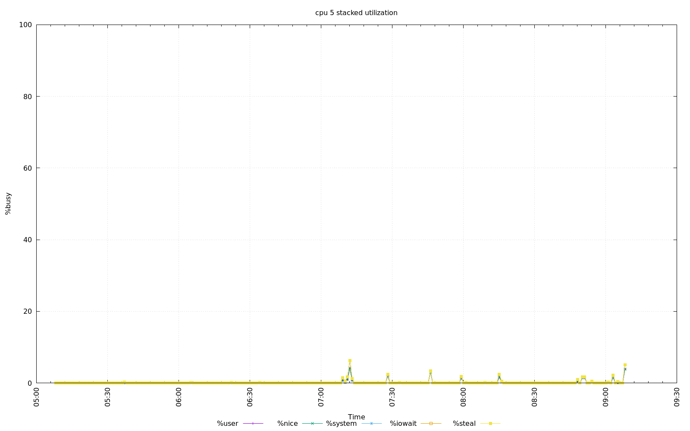

================================================================================
Database Test 7 throughput cpu Charts
================================================================================

