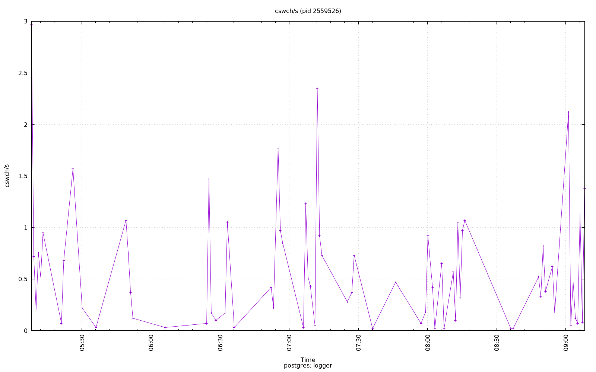

================================================================================
Database Test 7 pidstat logger Charts
================================================================================

.. image:: ../pidstat/pidstat-2559526-MEM.png
   :target: ../pidstat/pidstat-2559526-MEM.png
   :width: 100%

